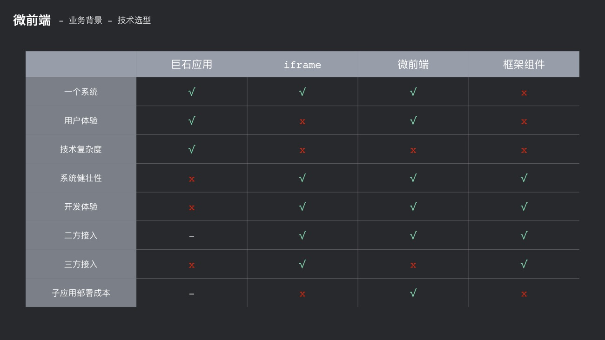
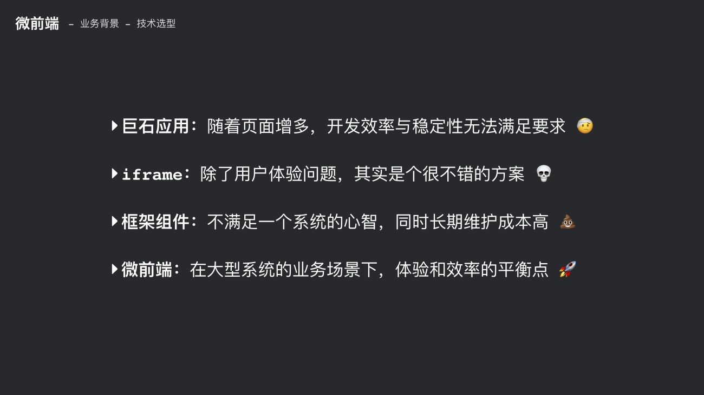

# 微前端

### 微前端概念

微前端早在 2016 年 thoughtWorks 的一个技术雷达上提出, 脱胎于后端微服务的概念.

以前, 单体应用的时代, 前后端各自的能力, 都是聚合在一起的. 随着后端微服务理念的出现, 后端会按功能维度对后端能力进行拆分. 然后在前后端交互的时候, 加上一层聚合层, 去做数据的聚合(BFF 层)和网关的处理. (类似携程工作时, java 的 RESTFUL 层)

微前端就是把微服务的理念搬到了浏览器端, 将单体的一个 web 应用也按照功能维度进行拆分, 然后再聚合到一个整体的应用架构下面, 这便是微前端的理念.

### 业务背景

什么情况下会需要用到微前端?

- 1, 工作台的场景, 基于产品体验的纬度
- 2, 大型单体应用, 侧重于想从技术纬度进行优化

工作台场景, 其实说的就是一些公司内部往往会有很多系统, 而日常的运营流程中, 会涉及到跨系统的一些操作. 因为每个系统都是单独的, 所以往往会存在交互体验不一致的问题, 并且一些页面跳转, 重新登录的操作, 效率也很低.

而且, 多个系统独立的话, 一些 BFF 层、中间网关处理层、前端的基础能力上, 都会存在很多的重复建设. 并且系统之间独立, 每个系统的具体实现逻辑是不可管控的, 从整体产品的角度出发, 这种重复建设和不可管控的情况, 无疑是不可接受的.

> [ BFF 架构: ](https://www.jianshu.com/p/eb1875c62ad3)
> 全称是 Backend For Frontend (服务于前端的后端), 服务端在设计 API 时, 会考虑到前端的使用, 在服务端直接进行业务逻辑的处理(多端应用 API 分离, 多个 API 聚合等等...), 所以 BFF 层也称为用户体验适配器. BFF 只是一种技术上的逻辑分层, 并非是一种技术. 类似于 Trip 中各业务端 JAVA 的 RESTFUL 层.
> (BFF 的常见用法: 访问控制、应用缓存、第三方入口)

大型单体应用场景, 就是我们通常说的巨石应用. 这类应用的特点很明显, 它的系统体量是非常大的. 单从其 bundle 构建出的文件体积来看, 单个文件可能都会超过 10M, 这种构建量, 在日常调试开发的时候, 严重影响开发体验和效率.

> ifchange 的老 fe 项目, 60 万行的代码量, 不加 node_modules 文件体积达到 377.4 MB. 每次构建开发环境 5 分钟起步, build15 分钟起步, (自己写的脚手架, 复制压缩图片、文件比较费时)

另一方面, 对于巨石应用, 项目的功能迭代、基础架构升级时, 需要耗费的开发和协作成本都很高. 因为体量大也会导致改动带来的影响面也非常广.
如果存在一些二方的需求和功能, 想要直接复用这块的功能时, 基于目前的 SPA 架构也很难实现, 基本上还是在现有系统再次实现相同的代码逻辑.

> 开发中的一方、二方、三方:
>
> - 一方: 一般指本项目和本工程中的类、方法和接口
> - 二方: 一般指公司内部的依赖库
> - 三方: 一般指外部开源库或开源项目贡献的 jar 包

### 技术选型

基于上面的业务背景, 摆在我们面前的技术方案有哪些?

- 巨石应用
  - 就是 SPA/MPA 的技术架构. 所有的系统融到一个项目里面, 肯定能做到交互体验一致, 并且能够管控技术的复杂度. 但是这样就会带来上面说的技术纬度的问题, 项目越来越臃肿.
- iframe
  - 在技术纬度纬度比较友好, 但是体验纬度就不行了. 比如: 嵌入页面的双滚动条, 路由无法同步, iframe 中的一些弹窗、遮罩交互
- 框架组件
  - 将常用的逻辑组成一个组件, 以 npm 包的形式在多个项目中引用. 这种只是对公用的一些逻辑做了一个收口, 部分程度上减轻了公用逻辑迭代的工作量, 比如只需要在这个 npm 包做修改, 然后其他业务线同步. 这样并没有本质上解决: 技术架构升级(升级之后, 所有业务线都要同步, 并且使用的技术栈要统一)、用户体验的优化(跨系统操作还是要跳转).
- 微前端
  - 将一个整体的系统, 按照功能维度进行拆分. 比如按系统的职位、ats、人才库、报表、设置等能力进行拆分成一个个单独的应用, 然后这些应用再统一接入到一个平台当中. 这样就完成了一个基于微前端的架构升级, 使平台的可维护性得到一个质的提升.
    四种方案的参数对比:
    
    四种方案的优缺点:
    
