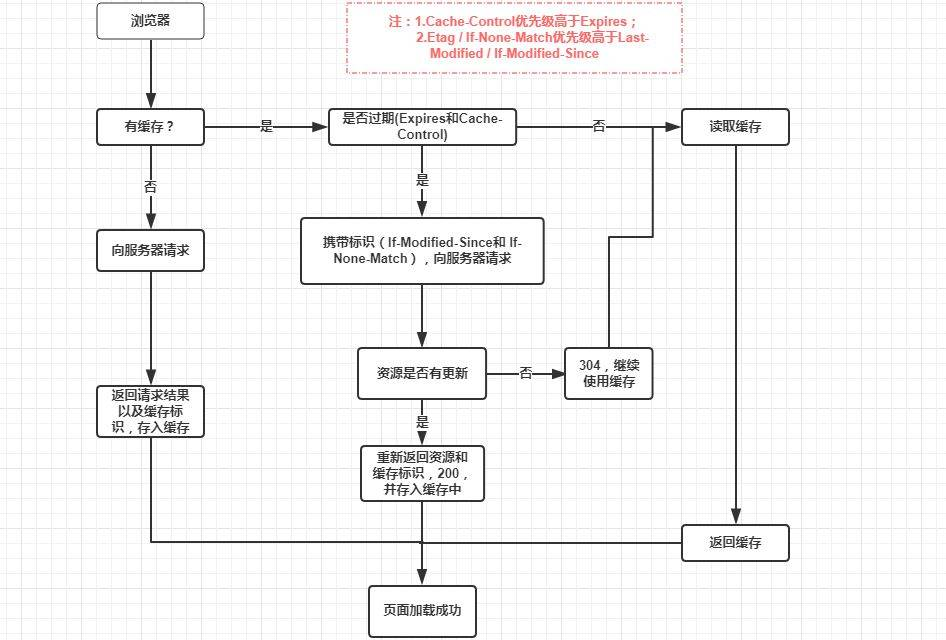

# 性能优化

### 构建工具提速

- 1，loader 解析文件很慢，所以要尽可能避免
  - loader 配置时使用 exclude、include 来指定作用范围，避免不必要的转译，比如 node\*modules 中的内容
- 2，一些基础的第三方库，一般不会更新，很多地方都会用到，所以让他们只打一次包，后面直接用打过的
  - Externals 不够聪明，一般情况下会发生重复打包的情况，CommonChunkPlugin 每次打包时都会生成一个 vendor，推荐使用 DllPlugin，借鉴 windows 动态链接库的概念开发出来的，这个依赖库不会随着业务代码一起打包，只有依赖自身发生版本更新时才会重新打包。使用时分两步：基于 dll 专属配置文件打包出动态链接库，基于 webpack.config.js 文件，打包业务代码
- 3，开启多线程打包模式
  - 使用 happypack 充分释放 CPU 在多核并发上的优势，把任务分解给几个子进程进行处理。使用是把 loader 的配置转移到 happypack 中

### 构建结果体积压缩

- 1，文档结构可视化，找出导致编译后文件过大的问题
  - 使用 webpack-bundle-analyzer 插件，去分析
- 2，拆分资源
  - 将一些公用的基础的第三方库抽离出来，避免重复打包。这里使用的是 DllPlugin，同上
- 3，删除冗余代码
  - Tree-Shaking，webpack 基于 es6 的 import/export 语法，在编译时进行静态文件依赖分析，来获悉用到了哪些模块，对没有用到的模块，在打包时会被去除。（因为是静态文件分析，所以只要被引入了，都会认为会被用到）
  - Tree-shaking 一般用来进行模块级别冗余代码的处理，对一些更细粒度的冗余代码清除，一般是在代码压缩和分离的时候做的。比较好的是 UglifyJsPlugin，可以配置在压缩过程中删除 console 语句、注释、多次静态值自动定义为变量、输出代码尽可能紧凑、开启缓存等。
- 4，按需加载
  - 实现方案： output 中配置 chunkFilename，结合异步加载路由组件（require.ensure()或 import()）
  - 优势：需要用到是才会加载，提高首次加载速度
- 5，Gzip 压缩
  - Gzip 压缩的原理是文本文件中找到一些重复的字符串，然后临时替换掉它们，从而使代码变小。
  - webpack 的 Gzip 和服务端的 Gzip： - webpack 的 Gzip，事实上就是为了在构建过程中去做一部分服务器的工作，为服务器分压。
  - 服务端的 Gzip 是通过在发起 request 时，在 header 中加上 accept-encoding:gzip 这句，服务器在返回数据时就会对响应进行压缩，然后浏览器进行解压缩。所以多出了压缩和解压缩的时间消耗，减少了文件体积节省出的传输时间，这个优化在响应大小为 1-2k 的时候是亏本的

### 图片优化

图片是网络请求中资源体积占比最大的一部分，尤其是在电商领域。所以在性能优化上面，图片的优化是必不可少的

- 1，针对不同的业务场景下选用不同的图片类型 
  图片常用的主要有 jpg/jpeg、png、svg、base64、webp 这几种，对其最主要的优化，就是
  - jpg
    - 有损压缩、体积小、不支持透明、加载快，所以常用于一些 banner 之类的大图
    - 以 24 位的二进制表示颜色，可以呈现出 1600 万（2^24）种颜色，所以一些色彩丰富的图用它也没错
    - 缺点是：线条感强、颜色对比强烈时，因为压缩的原因，会导致图片比较糊
  - png
    - 无损压缩、体积大、支持透明、质量高，所以常用于一些 logo 之类的小图
    - 分为 png-8、png-24 两种，分别可以呈现出 256(2^8)、1600 万(2^24)种颜色，他有更强的色彩表现力，对线条的处理更加细腻，支持透明，所以常用于一些复杂的、色彩层次丰富的图片中
    - 缺点是：体积太大
  - svg
    - 文本文件、体积小、不失真、兼容性好，常用于一些 icon
    - 基于 XML 语法的图像格式，和其他图片有着本质的不同：svg 是基于对图片形状的描述，而不是传统的基于像素点。因为是基于图片形状描述的矢量图，所以怎样放大都不会失真。
    - 缺点是：渲染成本大，制作成本大（可编程的）
  - Base64
    - 文本文件、依赖编码、小图标解决方案
    - base64 的出现是为了减少加载图片时的 http 请求
    - 缺点是：base64 会带来文件体积的膨胀、以及浏览器解析 base64 也有时间开销，所以只有非常小的图片才会该用 base64，因为这样节省的 http 请求开销足以弥补体积膨胀、浏览器解析的时间开销
  - webp
    - 年轻的全能型选手
    - 2010 年由 google 提出，旨在加快图片加载速度的图片格式，支持有损压缩、无损压缩。webp 像 jpeg 一样对细节丰富的图片信手拈来，像 - png 一样支持透明，想 git 一样支持动图。有损压缩时比 jpeg 文件更小，无损压缩时比 png 文件更小
    - 缺点：兼容性不好，safari、ie、firefox 都不支持
    - 使用时一般都是同时写成类似.jpg*.webp 的形式，前端判断浏览器环境后，自动将后面的*.webp 去掉，降级为 jpg 的形式
      淘宝中是写成：//img.alicdn.com/tps/i4/TB1CKSgIpXXXXccXXXX07tlTXXX-200-200.png_60x60.jpg\*.webp
- 2，雪碧图
  将多个小文件放到一张图片中，使用时利用 background-position 进行定位，这样就减少了加载图片时对服务器的请求次数，从而提高网页性能。
  base64 其实就是雪碧图的补充，应用于小文件比较少时的情况。
- 3，图片懒加载
- 4，走 CDN

### 浏览器缓存

浏览器缓存可以减少网络 I/O 消耗，提高访问速度，是前端性能优化的重要手段。它操作简单、效果显著。

浏览器缓存分为：http cache、memory cache、service worker cache、push cache

- http cache 
  目前最常用的一种缓存手段，分为强缓存、协商缓存，通过 cache-control、expires 等字段控制。优先级较高的是强缓存，强缓存命中失败时再走协商缓存。
  - 1，强缓存
    - 强缓存命中后，就会直接从浏览器缓存中获取资源，不会再与服务端发生通信。命中缓存，返回的 http 状态码是 200.
    - 强缓存的实现（从 expires 到 cache-control）：
      - 过去一直都是使用 expires，服务端返回响应时，在 Response Header 中添加 expires 字段（例：expires: Wed, 11 Sep 2019 16:12:18 GMT），该字段是一个字符串类型的时间戳，接下来如果浏览器再次请求资源，会去比对本地时间和这个 expires 时间，如果本地时间小于 expires 时间，则就去缓存中去取这个资源。这里就有问题，如果修改本地时间，或服务器和客户端设置的时间不一样，expires 就不能达到我们的预期。
      - 考虑到 expires 的局限性，在 http1.1 中新增了 Cache-Control 字段来完成 expires 的工作。它不仅可以完成 expires 的工作，优化了过期时间的比较方式，还进行了一些判断方式上的扩展，比如新增了 public、private、no-cache、no-store 等字段。cache-control 和 expires 同时出现时以 cache-control 为准。
      - expires 一般是通过 max-age 来进行过期时间的比较，他的值不是时间戳，而是一段时间，单位是秒。
      - public、private 是针对资源是否能被代理服务器缓存而存在的一组概念，默认是 private，但是显式的设置了 s-maxage，也就相当于设置了 public，s-maxage 表示的是代理服务器上的缓存时效，在代理服务器中优先级高于 max-age。
      - no-cache：避开了浏览器的缓存，直接去询问服务器资源是否过期。即直接走协商缓存的路子。
      - no-store：完全不使用缓存，只允许向服务端发起请求，并下载完整响应
  - 2，协商缓存
    - 协商缓存依赖于服务端与浏览器之间的通信，浏览器需要向服务端去询问缓存的相关信息，从而判断是重新发起请求获取完整资源还是从缓存中读取。如果服务端提示资源未改动（Not Modified），资源会被重定向到浏览器缓存，这种情况下网络请求的状态码是 304.
    - 协商缓存的实现（从 last-modified 到 Etag）：
      - 浏览器的首次请求，会在返回响应的 header 中添加 last-modified 字段，该字段是一个时间戳，随后我们的每次请求都会带上一个 If-Modified-Since 字段，值就是 last-modified。服务器接收到这个时间戳之后，会和资源在服务器上最后一次修改的时间做比较，看是否一致，如果不一致就返回一个完整的相应内容，并在 response header 中添加新的 last-modified 字段，否则就返回 304，response header 中也不会在由 last-modified 这个字段。但是使用 last-modified 会有问题，比如我编辑了服务器上的文件但内容没变，但是最后一次编辑时间却变了，下次请求过来时就是没命中协商缓存。还有文件更改在 1s 内完成时，因为 If-modified-since 的比较是秒级的，所以就会判定为没改文件，走了协商缓存。
      - 考虑到 last-modified 可能出现的问题，Etag 作为 last-modified 的补充出现了，Etag 会给每一个文件根据内容生成一个唯一标识字符串，只要文件内容不同，这个字符串就会改变，这样服务端就能精准的感知文件的变化。
      - Etag 生成过程会带来服务器额外开销，所以是作为 last-modified 的补充，两者同时出现时，以 Etag 为准。
- Memory Cache
  - 存在于内存中的缓存，优先级最高，命中强缓存后浏览器最先去尝试, 没有才回去 disk cache。
  - 但是我们不能主动去设置什么能进 memory cache，这个是由浏览器自发决定的。一般比较小的图片、css、js 是会被保存的
  - 生命周期很短，tab 关闭后就会被清空
- Service Worker Cache
  - 主要是用来实现离线缓存的，也可以实现消息推送、网络代理等功能
  - service worker 是独立于主线程之外的 javascript 线程，他脱离浏览器窗体，所以无法操作 dom。所以他只能通过自己的个人行为，来辅助我们的网页。我们通过 service worker 实现的缓存，就叫做 service worker cache
- Push Cache
  - http2 在 server push 阶段存在的缓存，这块知识比较新，所以用的人也比较少。
  - 他是缓存的最后一道防线，只有在 memory cache、http cache、service worker cache 都没有命中的时候，才会去询问 push cache，生命周期很短，存在于会话阶段，当 session 终止时，缓存也会随之释放。

> 浏览器在进行资源请求时, 会根据 response headers 判断有没有命中强缓存或协商缓存. 这里要注意, 强缓存和协商缓存命中之后, 都是从客户端缓存中加载资源(优先 memory cache, 其次 disk cache, tabs 生命周期结束时 memory cache 会释放), 而不是从服务器加载资源. 区别在于强缓存不发请求, 状态码是 200, 协商缓存会发请求到服务器, 状态码是 304.
> response headers 在 tcp 连接建立的时候就会返回, 所以是可以根据 response headers 中字段, 判断是否发起 http 请求的

(http 缓存使用详情: https://juejin.im/entry/5ad86c16f265da505a77dca4)
