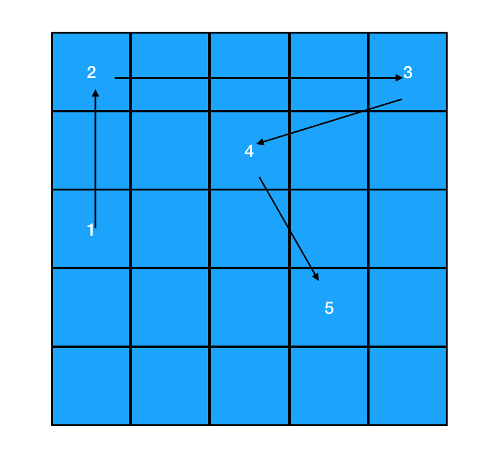
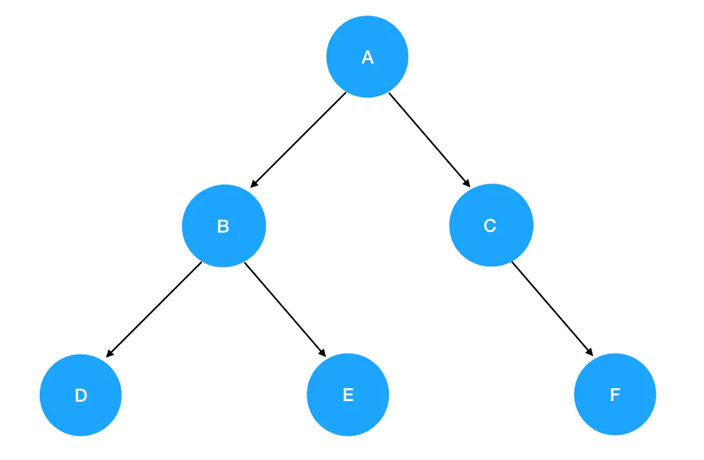

# 基础数据结构
基础的数据结构有: 
- 数组
- 栈
- 队列
- 链表
- 树

### 数组
- 数组的创建
  ```js
    // 直接赋值
    const arr = []

    // 构造函数
    const arr = new Array()
    // 实例化的一度好处, 是可以指定生成数组的长度, 并进行填充
    const arr = new Array(7).fill(1);   
    // [1, 1, 1, 1, 1, 1, 1]
  ``` 
  > 这里要注意, fill方法有局限性, 如果fill的是引用类型, 比如[], 那生成的arr中的所有[], 其实都是同一个, 指向的内存位置是同一个的.

- 数组的访问和遍历
  - 数组可直接通过索引访问, 比如: arr[2], 就可以访问到arr数组中第二个元素
  - 遍历, 遍历方法有很多, for、forEach、map、reduce等等, 其中**for循环的遍历性能最快**, 因为其他方法也是对for循环的封装, 并且for循环可以使用break终止遍历.

- 二维数组 (矩阵) 
  - 一维数组书写的时候, 看起来像是一条线
  - 二维数组的话, 就像是一个面了, 形似矩形, 所以也称为矩阵
  ```js
    const arr = [
      [1,2,3,4,5],
      [1,2,3,4,5],
      [1,2,3,4,5]
    ] 
  ``` 
  - 二维数组的初始化
    - 不能用fill([])的形式, 进行二维数组的初始化, 这样会有问题, 因为fill在填充坑位的时候, 填充的其实是对入参的引用, 所以填充的值指向的是同一个内存对象, 一个变, 其他都会变.
    - 可以使用for循环进行初始化
  - 二维数组的遍历
    - n维数组, 要用n层循环进行遍历
    ```js
      // 缓存外部数组的长度
      const outerLen = arr.length
      for(let i=0;i<outerLen;i++) {
          // 缓存内部数组的长度
          const innerLen = arr[i].length
          for(let j=0;j<innerLen;j++) {
              // 输出数组的值，输出数组的索引
              console.log(arr[i][j],i,j)
          }
      }
    ```
### 栈和队列
他们俩其实就是两种运算受限的线性表. js中可以通过数据进行实现, 不同之处在于他们对数组的增删权限有着不一样的限制.
- 栈 (Stack, 只用push和pop完成增删的数组)
  - 先进后出, 可以想象成我们以前去小店买的冰棍, 老板最先放进去的冰淇凌会落在冰柜的底部, 最后摆的则是在顶部. 这时候我们去买冰淇凌, 老板会先将顶部的取出来给我们. 所以, 越先放进去的越后取出来, 越后放进去的越先取出来.
  - 这种存取逻辑, 我们可以使用push和pop方法进行模拟
  ```js
    class Stack {
      constructor(props) {
        this.stack = props || [];
      }
      add(value) {
        this.stack.push(value);
      }
      remove() {
        return this.stack.pop();
      }
      isEmpty() {
        return this.stack.length === 0
      }
      getValue() {
        return this.stack
      }
    }

    // 初始状态，栈空
    const stack = new Stack();
    // 入栈过程
    stack.add('东北大板');
    stack.add('可爱多');
    stack.add('巧乐兹');
    stack.add('冰工厂');
    stack.add('光明奶砖');

    // 出栈过程，栈不为空时才执行
    while (!stack.isEmpty()) {
      // 单纯访问栈顶元素（不出栈）
      const top = stack.remove();
      console.log('现在取出的冰淇淋是: ', top);
    }

    // 栈空
    console.log(stack); // []
  ``` 

- 队列 (Queue, 只用push和shift完成增删的数组)
  - 先进先出, 类似于我们去排队吃肯德基, 先点餐的人先出餐, 后点餐的后出餐.
  - push、shift方法进行实现
  ```js
    class Queue {
      constructor(props) {
        this.queues = props || [];
      }
      add(value) {
        this.queues.push(value);
      }
      remove() {
        return this.queues.shift();
      }
      isEmpty() {
        return this.queues.length === 0
      }
      getValue() {
        return this.queues
      }
    }

    // 初始状态，栈空
    const queues = new Queue();
    // 入栈过程
    queues.add('伞兵一号');
    queues.add('伞兵二号');
    queues.add('伞兵三号');
    queues.add('伞兵四号');

    // 出栈过程，栈不为空时才执行
    while (!queues.isEmpty()) {
      // 单纯访问栈顶元素（不出栈）
      const value = queues.remove();
      console.log('现在取餐的是: ', value);
    }

    // 栈空
    console.log(queues); // []
  ``` 

### 链表
- 链表和一维数组类似, 他们都是有序的列表、线性结构(有且只有一个前驱, 一个后继)
- 不同点在于:
  - 链表的数据单位是节点, 节点和节点之间的分布, 在内存中是可以离散的. 
  - 数组的数据单位是元素, 在内存中, 元素与元素之间一般是紧紧相连的, 所以体现出的是一段连续的内存空间.
  > 
- 元素的获取
  - 因为数组是连续的, 所以元素的内存位置可以根据距离头部的距离计算得到. 所以可以通过索引获取到元素
  - 而链表怎么办, 元素之间是离散分布的, 没有关联如何获取. 答案是**没有关联, 创造关联**. 所以链表的每个节点都分成两个部分: 数据域和指针域. 数据域存储当前节点的值, 指针域存储下个节点的指向. 在js中, 可以通过嵌套对象的形式来实现.
  ```js
    const chain = {
      // 数据域
      val: 1,
      // 指针域，指向下一个结点
      next: {
          val:2,
          next: ...
      }
    }
  ```
  图形化为:
  
  > 如图, 链表的访问相对数据比较麻烦, 只能通过起点节点, 根据next, 一直访问到目标节点.

- 链表节点的创建
  ```js
   function ListNode(value) {
     this.value = value;
     this.next = null;
   }
   const node = new ListNode(1);
   node.next = new ListNode(2)
   // 这样就得到了一个长度为2的链表.
  ```
- 链表节点的添加
  - 链表节点之间的关系都是通过next指针来维系的, 所以链表节点的增删, 本质上就是在next指针上做文章.
  - 在尾部添加节点, 很简单只需要获取到尾部节点, 然后将next指向node3即可
    ```js
      const node3 = new ListNode(3);
      node2.next = node3
    ``` 
  - **任意两节点间插入节点. 这个是常考的知识点.** 要想完成这个动作, 我们需要变更的就是前驱节点和目标节点的next指针指向.
    ```js
      const node3 = new ListNode(3);
      node3.next = node1.next;
      node1.next = node3;
    ``` 
- 链表元素的删除
  - **删除的重点是找到前驱节点,** 只需要将前驱节点指向目标节点的next对象即可.
    ```js
      const target = node1.next;
      node1.next = target.next;
    ``` 
- 数组和链表的辨析
  - 增删操作上:
    - 对数组而言, 因为其在内存中的表现是一段连续的内存, 所以如果在人一个位置插入或删除元素的时候, 其后的元素都要往后或往前移动一格. 我们假设数组的长度是n, 那么因为元素的增删导致的需要移动的元素, 会随着n的增加而增加, 呈一个线性关系. 所以使用大O表示法来对数组的增加进行复杂度定义的话就是 O(n)
    - 而对链表而言, 因为它本身就是离散的, 插入/删除元素的话, 只需要更改目标/前驱/后继节点的指向即可, 跟链表的长度并没有关系, 所以复杂度是 O(1)
  - 访问上 
    - 对数组而言, 可以直接根据索引来访问, 可以做到一步到位, 所以复杂度为 O(1)
    - 对链表而言的话, 随着链表长度的变化, 需要查找的元素数量也会变多, 其趋势呈线性关系. 所以复杂度为 O(n)
  > 小结: 链表的插入/删除效率高, 而访问效率低. 数组的插入/删除效率低, 而访问效率高. 
> js中的数组并非真正的数组. 如果是纯数字的话,对应的确实是连续内存. 但如果定义了不同类型的元素, 其在内存中的分布就是非连续的(比如['ha', 1, {a:1}]). 此时js数组就不是严格意义上的数组, 之所以仍具有一些数组的特征, 其实是通过对象链表形式进行了支持, 其底层使用的是哈希映射分配内存空间.

### 树
- 只有一个根节点, 有很多子级节点的树状结构
- 关于树结构有以下概念:
  - 树的层次计算: 树的根节点所在的那一层为第一层, 其子节点为第二层, 以此类推
  - 节点和树的高度计算规则: 树的叶子节点高度记为1, 每向上一层, 高度加1, 逐步累加至目标节点时, 就是目标节点的高度. 树中节点最大高度, 称为树的高度
  - 度的概念: 一个节点开出去多少子节点, 被称为节点的度.
  - 叶子节点: 度为0的节点.
- 二叉树:
  - 可以没有根节点, 作为一颗空树. 如果不是空树, 那就必须由根节点、左子树和右子树组成, 且左右子树都是二叉树(空树也是二叉树)
  - 普通的树, 可以不区分左、右子树, 但是二叉树中, 左右子树的位置严格约定, 不能互换.
  - 二叉树节点的创建: 二叉树的每个节点都应该包含三个部分, 数据域、左子树的引用、右子树的引用.
    ```js
      function TreeNode(val) {
        this.val = val
        this.left = this.right = null;
      }
    ``` 
- 二叉树的遍历:
  - 按照遍历方式分:
    - 递归遍历(前、中、后序遍历)
    - 迭代遍历(层次遍历)
  - 按照遍历的顺序规则分:
    - 前序遍历
    - 中序遍历
    - 后序遍历
    - 层次遍历
  - 详细来说一下递归遍历
    - 首先我们假设左子树一定先于右子树遍历这个前提, 穷举遍历的可能顺序也不过三种: 根节点 -> 左子树 -> 右子树, 左 -> 根 -> 右, 左 -> 右 -> 根. 这三种根节点的遍历顺序分别被安排在了首要、中间、最后位置, 所以对应的也就是我们说的前、中、后序遍历.
    - 下面我们用递归函数来分别对这三种遍历进行实现, 首先递归函数主要就是两个东西: 递归式、递归边界.
    - 针对下图的遍历函数
     
    ```js
      // 前序遍历
      const preorder = (root) => {
        // 递归边界
        if (!root.value) {
          return null;
        }
        // 递归式
        // 先根节点
        console.log('当前遍历的结点值是：' + root.value)
        // 接着左子树
        preorder(root.left);
        // 最后右子树
        preorder(root.right);
      }
      preoder(A) // A、B、D、E、C、F

      // 中、后序遍历, 只是递归式中, 表达式的执行顺序进行调整
      // 中序遍历
      const inorder = (root) => {
        // 递归边界
        if (!root.value) {
          return null;
        }
        // 递归式
        // 先左子树
        inorder(root.left);
        // 接着根节点
        console.log('当前遍历的结点值是：' + root.value)
        // 最后右子树
        inorder(root.right);
      }
      preoder(A) // D、B、E、A、C、F
      

      // 后序遍历
      const postorder = (root) => {
        // 递归边界
        if (!root.value) {
          return null;
        }
        // 递归式
        // 先左子树
        postorder(root.left);
        // 接着右子树
        postorder(root.right);
        // 最后根节点
        console.log('当前遍历的结点值是：' + root.value)
      }
      preoder(A) // D、E、B、F、C、A
    ``` 
    > 何为递归: 函数Func直接或间接调用函数本身, 则该函数称为递归函数.
