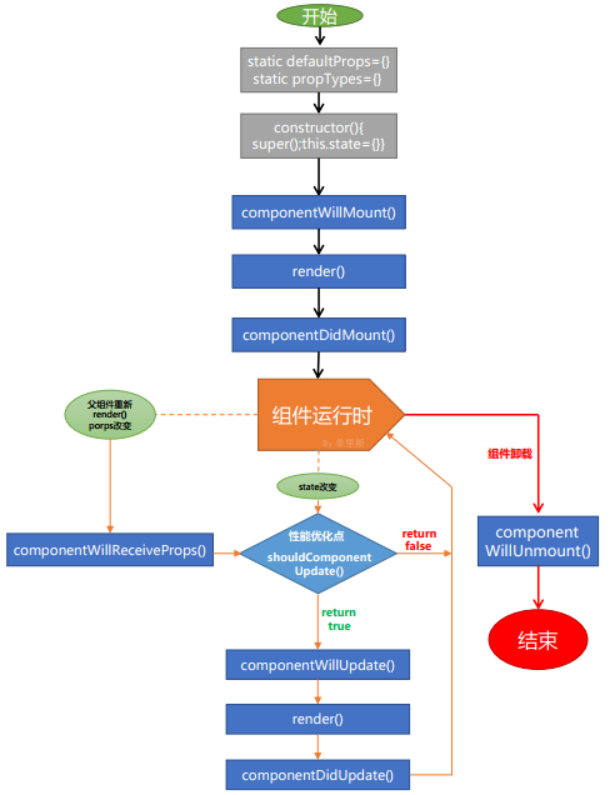

# Js 基础

### 数据类型分类：

- 分两种：原始类型（boolean，string，number，null，undefined，symbol），对象类型两种。
- 该分类是根据 typeof 来区分的，但是 null 的话会被错误认为 Object 形式，因为底层 null 的二进制是 00000， 判断对象是根据前三位是 0 来的判断，所以这是个 bug。
- symbol 是 es6 新出的一种数据格式，每一个值都是唯一的，里面的参数没有实际作用，只是用来标记给人看是什么的，传对象会被转为字符串，其他不会变。

### 数据在内存中的存储形式

内存分为栈内存(Stack)和堆内存(Heap). js 引擎在解析到声明语句时:

- 简单类型的值会放进栈内存
- 复杂类型的值放进堆, 引用放入栈内存

js 在解析到赋值语句时:

- 不论类型, 都会将栈内保存的东西, 进行复制替换的动作.

### 数据类型转换：

- 其他类型转布尔值：数值除 0, -0, NAN 外，都是 true；字符串除’’外，都是 true；undefined、null 是 false；引用类型是 true
- 其他类型转字符串：数值直接加引号；Boolean、函数、Symbol 也是直接加引号；数组是中括号变成字符串，里面的元素变成对应的字符串；对象是’[Object, Object]’
- 其他类型转数字：string 中全是数值则直接去掉引号，否则为 NAN；数组空的为 0，只有一个元素且为数值那么就是这个数值，其他则为 NAN；null 是 0；除数组外的对象都是 NAN；Symbol 会报错。
- 对象转原始类型：会分别依次调用对象原型上的 valueOf 和 toString 方法，如果转换为基础类型，就返回转换的值，如果没有就报错

### 不同数据类型进行 == 比较时的数据隐式转换顺序：

隐式转换是有标准的：

- 1，判断是否是 null 和 undefind 比较，如果是返回 true
- 2，判断是否为 string 和 number 的比较，如果是，string 转换为 number
- 3，判断其中一方是否有 boolean，如果有把 boolean 转为 number 再判断
- 4，判断是否是 Object 和 string、number、symbol 的比较，是的话把 object 转为原始类型再进行比较

#### 面试题：为什么[] == []为 false，[] == ![]却为 true？

解析：因为[]是对象，属于引用类型，在堆中是两个位置，所以不相等。![]为 false 符合第三种情况会变成 0，[]是对象，符合第四种情况，[]转为原始类型为’’，就变成了 ‘’ == 0 的判断，符合第二种，所以结果为 true。

> 注：字符串的比较是根据 unicode 编码进行比较的。

### 0.1 + 0.2 != 0.3

JS 在存储东西时，会将其转成二进制，很多小数在转成二进制时都是无限循环的，而 JS 采用的又是 IEEE 754 双精度版本会裁剪掉我们的数字，所以这就造成了精度丢失。在转回十进制时，0.1 就变成了 0.1(此处 16 个 0)2

### 闭包：

- 定义：函数 a 内部有个函数 b，函数 b 可以访问到函数 a 中的变量，那么函数 b 就是闭包。闭包存在的意义就是让我们可以间接访问函数内部的变量。
- 有些人会认为只有函数内部返回一个函数，才能叫做闭包，其实不是，函数内部的函数绑定到 window 下，也可以在外面直接访问到这个函数，从而用到外层函数中定义的变量。

  ```js
  function A() {
    let a = 1;
    window.B = function () {
      console.log(a);
    };
  }
  A();
  B(); // 1
  ```

- 闭包的应用场景

  - 循环体中, 保存每次循环时的变量

    ```js
      // 面试题：如何解决下面打印出不全是 6
      for (var i = 1; i <= 5; i++) {
      setTimeout(function timer() { console.log(i) }, 1000)
      }
      // 首先，当函数执行的时候，再找 i 的值时，已经变成 6 了，所以打印的时候全是 6

      // 方案 1:
      for (var i = 1; i <= 5; i++) {
      function(j) {
      setTimeout(function timer() { console.log(j) }, 1000)
      }(i)
      }
      // 这种就是就会生成六个自执行的 function，并且通过传参，在函数内部隐式定义一个变量 j = 1 / 2 。。。之类的，当定时器函数执行的时候，往外层找 j 就可以找到函数中保存下来的 j 了

      // 方案 2:
      for (var i = 1; i <= 5; i++) {
      setTimeout(function timer(j) { console.log(j) }, 1000, i)
      }
      // 定时器的第三个参数，会被当成定时器中函数的参数传进去的

      // 方案 3：（最推荐）
      for (let i = 1; i <= 5; i++) {
      setTimeout(function timer() { console.log(i) }, 1000)
      }
      // 通过 let 块会生成一个作用域的方式，来保存住 i
    ```

  - 模拟私有方法

  ```js
  var counter = (function () {
    var privateCounter = 0;
    function changeBy(val) {
      privateCounter += val;
    }
    return {
      increment: function () {
        changeBy(1);
      },
      decrement: function () {
        changeBy(-1);
      },
      value: function () {
        return privateCounter;
      },
    };
  })();
  console.log(counter.value()); // logs 0
  counter.increment();
  counter.increment();
  console.log(counter.value()); // logs 2
  counter.decrement();
  console.log(counter.value()); // logs 1
  // 这里的increment, decrement, value就是私有方法
  ```

### 对象的深、浅拷贝：

#### 浅拷贝：

可以通过 Object.assign 和展开运算符…来实现，他们会拷贝对象的所以属性值到新的对象中，如果属性值是对象的话，拷贝的就是地址，所以不是深拷贝。
大部分场景中浅拷贝足够了，我们可以通过其他方式避免直接修改属性值为对象时的这个对象。

#### 深拷贝：

常用的是 JSON.parse(JSON.string(object))，但是有局限性：会忽略 undefind、函数、symbol，且如果对象中存在循环引用，就会报错。
比较好的是通过递归的形式实现深拷贝，但是有很多边界条件需要判断, 比如值类型或 null 时直接返回, 引用类型再进行递归遍历, 以及 Map、Set 等其他数据结构的拷贝. 推荐使用 lodash 的深拷贝函数

### 原型和原型链：

#### 当我们创建一个对象时，我们发现可以使用很多函数，但是我们没有定义过他们，这是为什么呢？

每个 js 对象都是 Object 构造函数的一个实例，在实例化过程中实例自己会生成的一个\_\_proto\_\_对象，他会指向构造函数的 prototype，这样就实现构造函数上方法和属性的继承，因此 object.\_\_proto\_\_ === Object.prototype。所以 object 中没有定义，也可以直接用很多方法和属性可以用。

> 总结：实例通过\_\_proto\_\_指向原型，原型中有一个 constructor 表示构造函数，这个构造函数下会有一个 prototype 属性，该属性又指向回原型。注意：只有函数才会有 prototype 属性，而且每个函数都会有，\_\_proto\_\_是实例化后的对象才会有的属性。

#### 原型链：

实例对象和原型通过\_\_proto\_\_的方式连接在一起就组成了原型链

### 模块化：

- 优点：
- 1，解决命名冲突
- 2，增加复用性
- 3，增加可维护性
- 实现方式：
- 1，自执行函数
- 2，AMD、CMD
- 3，CommonJS
- 4，ESModule
- AMD：<br />
  依赖前置，加载完毕后才能使用，如 requireJs
- CMD：<br />
  依赖后置，在需要时，函数体中任意地方通过 require 后进行使用
- CommonJS：<br />
  以前是用在 node 中，现在通过 webpack 使得前端也可以使用。<br />
  通过在一个文件中使用 module.exports 输出一个对象，然后在另一个文件中通过 require 引用这个文件输出的内容。
- module 的基本实现：<br />
  module = {id: ‘xxxx’, exports: {}}；id 是用来 require 时寻找导出对象的，exports 中存放的是导出的东西 <br />
  var exports = module.exports 使得使用 exports 也可以进行方法和变量的导出。
  > 注意：不能直接给 exports 赋值，因为 exports 是和 module.exports 关联的，如果直接给 exports 赋值，就会改变它在内存中的指向，以后改变 exports 时，就不会同步改变 module.exports 的值，无法完成导出了。
- require 的基本实现：<br />
  会将引入的 module 包装进一个自执行的函数中。

```js
var load = function (module) {
  var a = 1;
  module.exports = a;
  return module.exports;
};
load(module);
```

- ESModule: <br />
  是原生实现的模块化方案，与 CommonJS 有以下区别：
  - 1，CommonJS 支持动态导入，即路径可以是变量，ESModule 暂不支持
  - 2，CommonJS 是同步导入，因为用于服务端，文件都在本地，同步导入即使卡住主线程，影响也不大。
    ESModule 是异步导入，因为用于浏览器，需要下载文件，如果也用同步导入，会对渲染有很大影响
  - 3，CommonJS 在导出时是值拷贝，就算在导出时值变了，导入的值也不会改变，如果需要值，必须重新导入一次。ESModule 采用的是实时绑定的方式，导入导出的值指向的是同一个内存地址，所以后期改变导入的值，另一个文件中再次导入时会是更改后的值。

### Proxy：

- 实现对象的代理
- 代表案例：<br />
  vue2.0 中是通过 Object.defineProperty 来进行属性劫持实现数据的双向绑定的，vue3.0 中就改成了使用 Proxy 来实现数据的响应式。
- 语法：<br />
  ```js
  let p = new Proxy(target, handler);
  ```
  target 是要代理的对象，handler 是一个对象，表示的是原对象原型上的一些方法、属性。比如 set 函数、get 函数。

### JS 异步编程：

#### 回调函数：

在以前，如果需要在某个步骤完成之后（比如接口请求），再去执行指定的代码块，都是通过回调函数的形式完成的。这样很容易就会出现函数一层套一层的问题，使得代码耦合到一起，不利于维护，也很难处理错误。

#### 异步解决方案：

- Generator
- Promise
- async、await
- 定时器
- Generator
  > Es6 中的新概念，可以用于控制函数的执行。generator 函数执行时，函数体中的变量会被保存到内存中，下次继续执行时，再从内存中取。
- Promise：
  - 承诺，承诺在未来会有一个确切的答复，该承诺有三个状态：pending、resovled、rejected
    > 三种状态中只有 pending 可以变成其他状态，一旦状态变成 resolved、rejected 之后，就不能再次改变了
  - 当我们将一个函数实例化为 promise 时，该函数是会立即执行了，通过 .then() 来接收返回值，返回值也是一个 Promise，如果你在 then 中用到了 return，return 的值会被 Promise.resolve 包装成一个 Promise。
  - promise 的缺点：无法取消 Promise、错误需要通过回调函数捕获。
- async、await：
  - async、await 可以说是异步的终极解决方案了，相比于 Promise 的优势在于解决了 then 方法的调用，毕竟一大堆 then 方法也很恶心的。在使用时要注意，多个没有依赖的异步代码就不要使用 await 了，因为 await 在执行顺序上被改造成了同步代码，多个异步没有依赖性，仍然同步执行就会造成性能降低，这时推荐使用 Promise.all 方法包装这几个异步
  - async 的实现：其实就是用 Promise.resovle 包装了一下
  - await 的实现：其实就是 generator 加 Promise 的语法糖，且内部实现了 generator 的自动执行。
- 定时器：
  - setTimeout、setInterval、requestAnimationFrame
  - setTimeout、setInterval 都不是说一定会按期执行的，因为 js 是单线程，一旦前面的代码影响了性能，就会使这两种定时器不会按期执行

### 手写 Promise：

- 1，内部需要维护三个状态：pending、resolved、rejected
- 2，声明一个属性 value，用来保存 resolve、reject 中传入的值
- 3，内部需要实现两个函数数组 resolvedCallbacks、rejectedCallbacks，用于存储 then 中的回调。因为当执行完 Promise 时状态可能还是等待中，这时应该把 then 中的回调保存起来，当状态改后，再去调用。
- 4，实现 .then 方法，then 属于 Promise 原型上定义的方法
  > - <a href='../JS/Senior/MyPromise.js'>查看代码</a>
  - 参考地址: http://www.cnblogs.com/huansky/p/6064402.html#commentform
  - 总结：Promise 的实际原理就是把通过原型链上的 then 方法，把 then 中的 callback 传到 Promise 函数内部去执行，所以要在函数中实现 callback 的调用，比如：
    ```js
    new MyPromise((resolve) => {
      setTimeout(() => {
        resolve("resovle success");
      }, 1000);
    });
    ```
- Promise 的串联：
  即在连续的 then 方法中，如何保证第一个 then 方法执行完毕后，再执行第二个 then 方法。
  就是在当前 then 方法中，最外面包一层 Promise，在当前 then 被执行到之后，再通过包的这层 Promise 的 resolve 方法将下一个 then 方法中的函数执行一下，这样就实现了 Promise 的串联执行（顺序调用）
- Promise.all 方法：
  接收一个元素为 Promise 对象的数组作为参数，当所有 promise 状态都已完成之后，才会返回结果。promise 数组中只要有一个失败，all 方法就会烦会失败

### 浏览器中的进程

- 浏览器进程
  - 主要负责用户交互, 子进程管理, 和文件存储功能
- 网络进程
  - 面向渲染进程和浏览器进程提供网络下载功能
- 渲染进程
  - 主要职责是把网络下载的 HTML、CSS、JS、图片等资源解析为可以显示和交互的页面.

### 宏任务和微任务

#### 宏任务

宏任务大概包括以下几种:

- 页面渲染事件 (如: 解析 dom、计算布局、绘制)
- js 脚本执行
- 用户交互事件 (如: 鼠标点击、页面滚动、放大缩小等)
- 网络请求完成、文件读写完成事件

为了协调宏任务有条不紊的在**主线程**上执行, 页面进程引入了消息队列和事件循环机制, **渲染进程**内部维护了多个消息队列, 比如延迟执行队列和普通的消息队列. 然后主线程采用一个 for 循环, 不断的从这些任务队列中取出任务并执行任务. 我们把这些消息队列中的任务称为宏任务.

> V8 引擎是单进程的, 一次只能执行一个宏任务, 一般是先执行页面进程, 再执行渲染进程, 两个不会同时进行

#### 微任务

微任务就是一个需要异步执行的函数，执行时机是在主函数执行结束之后、当前宏任务结束之前。

- 微任务的的运转系统, 要基于 V8 引擎的层面来分析: 当宏任务在执行时(比如执行一段 js 脚本), V8 会为其创建一个全局执行上下文, 同时在内部还会创建一个微任务队列, 当宏任务执行时产生的微任务都会被 push 到这个微任务队列中, 等到当前宏任务即将执行完毕, js 引擎准备退出全局执行上下文并清空调用栈的时候, js 引擎会去检查全局执行上下文中的微任务队列, 按顺序执行队列中的微任务.
  > 一个宏任务对应一个微任务队列
  > 微任务中产生的微任务不会计入下一次宏任务, 会在当前宏任务中执行
- 微任务的产生:
  - dom 节点的变化(比如: 新增, 修改, 删除), 会产生 dom 变化记录的微任务
    > 所以会有 dom 元素中内容变了, 页面却没有渲染的情况
  - Promise 的各个方法(resolve, reject, catch, finally 等), 会产生微任务

### 面试题解析

```js
document.querySelector("#root").innerHTML = "zzzzzzz";

Promise.resolve().then(() => {
  var now = Date.now();
  while (Date.now() - now < 4000) {}
  console.log("微任务执行完成");
});

var now = Date.now();
while (Date.now() - now < 4000) {}
console.log("宏任务执行完成");

// 4s后打印: 宏任务执行完成
// 紧接着浏览器中dom: 内容改变
// 4s后打印: 微任务执行完成
// 紧接着页面更新
```

解析: 首先 js 执行是一个宏任务, 所以从上往下一边执行完之后, 先打印宏任务即将执行完成. 然后执行微任务, 这里有两个, 一个是 dom 改变, 一个 promise. promise 在 4s 后执行完毕, 进入下一个宏任务: 页面渲染.

#### 时间循环机制对宏任务进行切割, 优化体验

对于计算量很大的代码, 比如百亿次的运算, 可能要十几秒, 这时候主线程 js 运算占用, 页面就无法进行交互了, 这时我们可以通过 setTimeout 的形式, 对运算进行分片, 这样在运算过程中, 就可以穿插如进程对页面的交互处理了.

# CSS 基础

### 什么是 BFC？怎么触发？

- Block Formatting Context，块格式化上下文，是 web 页面可视化渲染的一部分，是块盒子的布局过程发生的区域，也是浮动元素与其他元素交互的区域。他是页面中的一块渲染区域，有着自己的渲染规则，它决定着其子元素将如何定位，以及和其他元素的关系和相互作用。
- BFC 可以看作是一个封闭的大箱子，其里面的元素无论如何布局，都不会影响到外面的元素。
- CSS 中常见的布局方案有三种：普通流、浮动、绝对定位
- 普通流：元素按照其在 HTML 中出现的顺序，从上到下进行布局，在这个过程中，行内元素水平排列，一排排满之后换行。快元素则会被渲染为完整的一行，除非另外指定，否则所有元素默认都是普通流定位。
  浮动：在浮动布局中，元素首先按照普通流的位置出现，然后根据浮动的方向，尽可能的向左边或右边布局，其效果和印刷版的文本环绕类似
- 绝对定位：在绝对定位中，布局会整体脱离普通流，所以绝对定位元素不会对兄弟元素造成影响，而元素的具体位置由绝对定位的坐标决定。
- BFC 属于普通流。

### BFC 的触发：

- 1，body 根元素
- 2，浮动元素：float 除了 none 意外的值
- 3，绝对定位元素：position（absolute 或 fixed）
- 4，display：inline-block、table-cells 和 flex
- 5，overflow 除了 visible 以外的值（hidden、auto、scroll）

### BFC 的应用：

- 解决统一 BFC 下，外边距会发生折叠（两个兄弟块元素，上面的 marginBottom 会和下面的 marginTop 的值合并，将其放到两个不同的 BFC 容器中，即设置了 overflow:hidden;的容器）
- 清除浮动（容器内元素浮动后，脱离了文档流，所以容器的高度发生塌陷只剩下边框的高度，如果使用 overflow:hidden;把容器变成 BFC 容器后，容器就会包裹着浮动元素）
- 阻止元素被浮动元素覆盖（两个兄弟块元素，上面的左浮动后，会占据下面的那个块元素的部分区域。这时如果给下面的那个设置一个 overflow:hidden;会把下面的变成一个 BFC 容器，他的区域就会收缩到右侧，可以用来做右侧响应式宽度）

# 算法基础

### 去重算法

### 排序算法

- 冒泡：先排右侧大的。从左到右，相邻两个元素比较，后面的小就调换位置，这时最后一个肯定是最大的，之后最后一个就不用参与比较了。
- 选择排序：先排左侧小的。从左到右，找出当前元素及右侧的元素中最小的那个索引，与当前索引交换。之后第一个就不参与比较了。
- 插入排序：保证左侧排序。从左到右，依次从第二个开始，和前面的所有元素比较，比较时如果前面的大了，就立马调换位置，然后继续一直比到最前面。每次比较保证前面的元素已排序。

### 洗牌算法

# 数据结构

### 栈

栈是一个线性的结构，只能在某一端添加或删除数据，遵循先进后出的原则。可以通过数组的 push 和 pop 方法实现

### 队列

- 队列也是一个线性的结构，它是在一端添加数据，在另一端删除数据，遵循先进先出的原则。
- 队列分为：单链队列（正常的先进先出，数组的 push 和 shift 可实现）、循环队列（用一个头尾相接的数组，将队列放入其中，中间留至少一个元素的空余空间，这样空间就可以循环使用，避免了单链队列中前面的出队之后空出的空间）

### [链表](https://juejin.im/entry/59cb70995188256aa423b680)

- 栈、队列底层存储数据的数据结构其实都是数组，数组在 js 中被实现成了对象，相对于其他语言 效率低了很多。这时我们就可以考虑使用链表来代替它，链表除了对数据的随机访问，几乎可以适用于所有数组使用的情况中。
- 链表是一个个节点的集合，分为单向链表、双向链表、单向循环链表、双向循环链表，其中最常用的是单向链表。
- 单向链表：每个节点都有两部分：数据、下个节点的引用。链表的尾元素指向 null，表示链接结束的地方，链表的起始点确定比较麻烦，一般会在最前面添加一个特殊的节点，称为头节点。

- 链表中插入节点：将前面节点中的 next 指向插入的节点，同时插入的节点指向 前面节点之前的 next 指向
- 链表中删除节点：将前面的节点的 next 指向改为当前节点中 next 指向
  寻找节点时，一般是通过 while 循环进行链表上索引的移动 while ( currNode.element != item ){ currNode = currNode.next; }
- 双向链表：尽管从头节点进行遍历比较方便，但是反过来，从后向前遍历却不容易，所以通过给节点增加一个 previous 属性，让其指向前驱节点的链接，这样就形成了双向链表
- 链表的实现：两个主要类 Node（element（当前节点的元素）、next（下一个的引用））、LinkedList （提供对链表进行操作的方法，增、删、查、显示链表、头节点）

### 树

- 二叉树<br />
  二叉树是最常见的树结构，有一个根节点，每个节点至多拥有两个子节点，分别是：左节点和右节点。树的最底部节点称之为叶节点，当这个树的叶节点数量为满时，可称之为满二叉树
- 二分搜索树<br />
  二叉树的一种，特性是每个节点的值都比左子树的值大，比右子树的值小。这种存储方式很适合数据搜索

# js 高级

### 浏览器缓存机制：

#### 基本介绍：（具体可见笔记 - 性能优化）

- 缓存是性能优化中的一种优化方式，可以显著的减少网络请求带来的时间损耗。
- 对于一个数据请求，可以分为网络请求、后端处理、浏览器响应三个步骤。缓存优化的是第 1、3 这两步。
- 浏览器缓存机制的三个部分：<br />
  缓存位置、缓存策略、实际场景应用缓存策略
- 缓存位置：<br />
  缓存位置分四种，并且各自有优先级，当依次查找缓存都没有命中时，就会去请求网络，所以缓存机制的查找顺序是：
  - 1，service worker（通过代码，自由控制缓存哪些文件的，以后该文件都会从 service worker 中获取，如果没命中，则会根据缓存位置往下找）
  - 2，memory cache（内存中的缓存，关闭 Tab 页就会释放，貌似不能人为触发，浏览器主动进行的）
  - 3，disk cache（存储在硬盘上的缓存，Http header 实现）
  - 4，push cache（存储于当前会话中，国内用的较少，兼容性不好，比如 Edge 和 Safari）
  - 5，网络请求
- 缓存策略：
  分为：强缓存和协商缓存，都是通过 Http header 实现。

### 什么是 MVVM？和 MVC 有什么区别？

首先 react 和 vue 两个都不是 MVVM 的框架，只是借鉴 MVVM 的思路，抽象出了一个 ViewModel 的概念。

- M：model，一般就是本地数据和数据库中的数据
- V：view，就是用户看到的视图
- VM：viewModel，抽象出的一个概念，他只关心数据和业务的处理，而不关心 View 如何处理数据

View 和 ViewModal 进行绑定，view 和 viewModel 中的数据改变时，会及时进行同步。model 和 viewModel 则是单向通信的关系，即：ViewModal 的更新会去通知 Model， Model 的更新也会去通知 ViewModal<br />
以 react 框架举例，view 就是纯视图组件，viewModel 就是整个的组件实例（引入 redux 的情况下就相当于 controller 层），model 则是在引入 redux 的情况下和组件分离之后的 action，reducer 等<br />
之所以说 react 和 vue 不是真正的 MVVM，是因为他们是通过绑定或其他的方式将 view 和 viewModel 绑定在一起的，而不是通过 ViewModel 将视图中的状态和用户的行为分离出一个抽象

### 浏览器渲染原理

Js 执行有一个 js 引擎，浏览器渲染也有一个渲染引擎，不同浏览器的渲染引擎内核是不一样的，谷歌和 safari 都是 webkit，火狐是 gecko。

### 浏览器将 html 转换为 DOM 树

字节数据 -> 字符串 -> Token -> Node -> DOM，在解析 html 的时候遇到 css 和 js 文件，浏览器回去下载和解析这些文件

- 1，字节数据：首先浏览器回去请求 html 文件，网络传输的内容其实都是 0、1 这些字节数据
- 2，字符串：就是我们写的代码
- 3，Token：浏览器会将字符串通过词法分析拆成一块块，并给这些内容打上标记，这一过程叫做标记化
- 4，Node：这些标记会转化成 Node(节点)
- 5，DOM：Node 根据不同 Node 之间的联系构建为一颗 DOM 树

### 浏览器将 CSS 转换为 CSSOM 树

字节数据 -> 字符串 -> Token -> Node -> CSSOM

#### dom 渲染时如何确定每一个节点的样式？

因为样式可以指定节点设置也可以继承，所以如果要确定一个元素的样式到底是什么，浏览器得递归 CSSOM 树。浏览器解析 css 选择器是从后往前的。比如 div > a > span { color: red; } 会找到所有的 span，往上找 a，之后再往上找 div，然后给符合要求的 span 进行上色。

#### css 选择器的解析为什么是从后往前的？

因为从前往后的话，第一个选择器下的所有子节点都要去遍历一次，而且如果遍历到叶子节点后，如果不满足，还要回溯到上另一个分叉上继续往下遍历。这种就比较消耗性能。而从后往前，一旦不满足直接放弃，没有回溯

### 为什么操作 DOM 慢？

操作是 js 走的是 js 引擎，DOM 是渲染引擎的东西，所以用 js 操作 dom 会涉及到两个线程之间的通信，那么势必会带来一些性能上的损耗。dom 操作一多，就等同于一直在线程之间通信，并且 dom 操做有可能带来重绘回流，也就造成了性能上的问题。

### 插入几万个 dom，如何实现不卡顿？

同时插入肯定会卡顿，所以可以采用分批插入的方式：

- 1，virtualized scroller（虚拟滚动: https://github.com/bvaughn/react-virtualized）
- 2，requestAnimationFrame 的方式插入 DOM
  虚拟滚动的原理是只渲染可见区域的 dom，非可见区域的 dom 就完全不渲染，在页面滚动的时候去实时替换渲染的内容。

### 阻塞渲染

渲染的前提是生成渲染树，所以阻塞渲染就是在 html 和 css 里。如果你想渲染的很快，就应该降低一开始渲染的文件大小，然后扁平 dom 层级，优化选择器（因为 dom 样式的确定，会根据选择器去一级级的找到 dom）。对于 script 标签，当浏览器解析道之后，就会暂停构建 dom，而去解析 js。所以建议都是将 js 放在 body 下面，当然现在有了 defer 和 async，也可以实现 script 标签的异步加载。defer 是并行下载，html 解析完成后，再同步解析 js。async 是另开线程下载和解析，当前 js 中没有依赖时才可用 async。

### 重绘和回流

- 重绘：只是更改外观而不会影响布局的节点改变，比如文字的 color
- 回流：布局或几何形状的改变，比如浮动，文字变多
  一般浏览器是每秒 60Hz 的刷新频率，因为 60Hz 的刷新频率，肉眼基本上就会感觉很流畅了。所以重绘和回流的检测一般就是 1000 / 60 = 16.6ms 更新一次。

减少重绘和回流：使用 transform 替代 top、使用 visibility 替代 display:none;、动画速度选择慢一点或使用 requestAnimationFrame、避免 css 选择器层级过深、将频繁重绘或回流的节点设置为图层、video 或 iframe 标签

### React 框架：

#### virtual dom：

##### 什么是 virtual dom？

首先 Dom 是一个多叉树的结构，virtual dom 是用 js 对象模仿真实 dom 的数据结构创建出的一个多叉树的数据结构，他最终会通过 ReactDom.render 方法插入到真实 dom 中。virtual dom 保存了真实 dom 的层次关系和一些基本属性

##### 为什么要用虚拟 dom？

- 1，比原生 dom 操作有性能优势。因为虚拟 dom 可以使用 diff 算法，快速找出所有需要更新的 dom 节点。有针对性的更新肯定是比无脑的全部更新要快很多的，因为 dom 的更新有可能会触发页面的重绘和回流，比之通过 js 找出差异项要占用更多的性能。
  > 注：如果直接通过 js 去更新 dom，是会比虚拟 dom 的更新快的，但是实际中我们往往会因为不确定哪些东西是需要更新而去全部更新某些 dom 结构，比如列表
- 2，另外 virtual dom 最大的优势还是可以将其当作一个兼容层，用来对接非 web 端的系统，实现跨端开发、SSR、同构渲染等

##### 为什么虚拟 dom 会提高性能？

如果没有虚拟 dom 的话，当数据改变时简单点就是直接重置 innerHTML，如果在一个大型列表里数据全部改变的话，这种方式算是比较好的，但是实际中，我们往往不只是改变了一组数据，这时如果把所有的标签全部替换，就很浪费性能了。虚拟 dom 的形式会通过 diff 算法，找出需要更新的地方，只更新必要的 dom，因为虚拟 dom 的 render 和 diff 比较都是 js 操作，比大串或多范围的 dom 操作相比要便宜很多。

##### diff 算法的优越性：

diff 算法的优越性是因为它实现了时间复杂度 n^3 到 n 的一个数据处理优化，因为我们正常比较一个树哪里不同可能会跨节点去不叫，但是 diff 算法的规则不是这样的， **它主要是分为三层：tree diff、component diff、element diff**

- tree diff：<br />
  将 dom 树按照层级进行分解，只比较同级的节点，如果同级节点的名称发生改变，是会先删除老的节点，然后再把新的节点插入进去
- component diff：<br />
  首先判断是不是同一类型的组件？如果是按照 tree diff 去比较（组件也可以当成一个树）。如果不是，该组件就被标记为 dirty component，最终被删除。这里同一类型的组件，也可能虚拟 dom 没有发生更新，所以 react 中支持在 shouldComponentUpdate 中判断改组件是否需要 diff。
- element diff：<br />
  列表结构的每个单元加一个唯一的 key 属性，方便比较元素是插入还是移动、删除。（这里的 key 不建议直接使用 index，因为如果只是元素的位置发生改变，是不需要重新渲染 dom 的，使用 index 他就会重新渲染）

### Vue 与 React 的区别：

vue 的 api 设计非常简洁，但是实现方式却让人感觉很魔法，开发者上手容易，但是实现原理很难说清楚。相比之下，react 的设计哲学就非常简单，虽然有很多需要自己处理的细节问题，但是没有引入任何新的概念，相对更加干净和简单。

vue 内部实现的按需更新组件，react 则需要通过 shouldComponentUpdate 自行实现

Vue 的表单是可以进行数据双向绑定，相对于 React 来说开发上更加方便，但是 React 也可以通过 setState 实现数据的双向绑定，两者本质没什么区别。

数据改变方式上不同，Vue 相对而言简单许多，React 则需要使用 setState 来改变状态，
react 使用的是 JSX，有一定的上手成本，需要一些列的工具链（babel 将 jsx 语法解析成 virtual dom 的形式）

### 为什么我们可以直接在 js 文件中写标签？

这些标签其实是 jsx 语法，他们其实并不是合法的 js 代码，而是对 js 的语法扩展，可以通过 babel 进行 jsx 语法的解析，最终会生成类似 React.createElement(‘h1’, { className: ’title’ }, ‘hello world’)，并通过 ReactDOM.render 方法插入到指定的 dom 节点中变成真实 dom。

```js
  ReactDOM.render(
    <h1 className='title'>Hello, world!</h1>,
    document.getElementById('root')
  );
  // 经过转换，就会变成：
  ReactDOM.render(
    React.createElement( 'h1', {className: ’title'}, 'Hello, world!' ),
    document.getElementById('root')
  );
```

所以通过 JSX 语法我们就可以很方便的在 js 代码中书写 html 片段。

这里 ReactDOM.render 方法的作用是将生成的虚拟 dom 变成真实 dom，并且插入到真实 dom 中

### 为什么在有 JSX 语法的文件中，没有用到 React 但是为什么要引？

因为 babel 解析 JSX 的时候，会调用 React.createElement 方法哦。具体可以仔细看看上面的小标题：为什么我们可以直接在 js 文件中写标签？

### render 函数是做什么的？

render 并不做具体的渲染动作，它只是返回一个 jsx 描述的结构，最终由 react 来操作渲染过程。
render 函数并不往 DOM 树上渲染或装载内容，它只是返回一个 JSX 表示的对象，然后由 React 库来根据返回的对象决定如何渲染。React 库肯定是要把所有的组件返回的结果综合起来之后，才知道该如何产生对应的 dom 修改

### setState 机制

setState 是异步的，每次 setState 时都会提交一次 state 修改到队列中，并不会立马修改 this.state。等满足一定条件时，react 会合并队列中的所以修改，触发一次 update 流程，更新 this.state。setState 的这种批更新机制减少了 udpate 的触发次数，从而提高了性能。
setState 的第二个参数是回调函数，可以用来监听 state 的更新完成，它是在 componentDidUpdate 之后触发的
(注：setState 并不完全是异步的，当放入 setTimeout 中时，就是同步执行的)

### 组件 update 的流程

props 引起的会先进入 componentReceiveProps 钩子，然后进到 shoudComponentUpdate，setState 引起的会直接进到 shoudComponentUpdate 中去判断是否进行状态的更新，如果更新就会进到 componentWillUpdate 中这里面还没有更新，出来后就会和组件当前的 state 进行合并，这时数据已经更新，然后进入到 render 中，render 根据传入的新数据，重新生成一个 JSX 结构，react 汇总所有组件的新 JSX 结构后，使用 diff 算法，对比新旧两个 JSX 结构（此处最消耗性能），获取到两者之间的差异，然后根据这些差异对 ui 进行最小化重渲染。在算法比对过程中，react 就已经精准的知道有哪些地方发生了改变以及需要如何改变

### react 的生命周期：

- 初始化：componentWillMount、render、componentDisMount
- 运行中状态：componentWillReceiveProps、shouldComponentUpdate（性能优化点，可以使用 setState）、componentWillUpdate、render、componentDidUpdaate
- 销毁阶段:componentWillUnMount

  > 注：getDefaultProps、getInitialState 不是生命周期，但是他们是在 componentWillMount 之前执行

父组件的每一次 render，不论有没有向子组件中传递属性，都会触发子组件的 componentWillReceiveProps 函数，如果没有 shouldComponentUpdate 会默认继续往下执行生命周期，所以可以在 shouldComponentUpdate 中加一个判断判断是否需要更新。

fiber 将 React 渲染分成两个阶段：Render（接收新数据判断是否更新，更新时进行 diff 比较，找出哪些需要更新。生命周期包括：render 及之前）、Commit（将 render 收集到的信息更新到真实 dom，完成后调用 componentDidMount / componentDidUpdate）

### React 父子、兄弟组件生命周期的执行顺序：

- 父子组件初始化时，依次执行了哪些生命周期：
  father_componentWillMount、father_render、child_componentWillMount、child_render、child_componentDidMount、father_componentDidMount
- 父组件更新时，父子组件依次执行了哪些生命周期：
  father_shouldComponentUpdate、father_componentWillUpdate、father_render、child_componentWillReceiveProps、child_shouldComponentUpdate、child_componentWillUpdate、child_render、child_componentDidUpdate、father_componentDidUpdate
- 兄弟组件初始化时，依次执行了哪些生命周期：
  按照在父组件中的顺序，先执行上面的 componentWillMount、render，然后再依次执行 componentDidMount
- 父组件更新时，兄弟组件依次执行了哪些生命周期：
  按照在父组件中的顺序，先执行上面的 componentWillReceiveProps、shouldComponentUpdate、componentWillUpdate、render，然后再依次执行 componentDidUpdate

### 受控组件

一些组件在每次 onChange 的时候通过 setState 去更新组件中的值，这种值通过 state 来控制的组件，我们就叫他受控组件。比如 input 框

### 高阶组件（Higher Order Component）

将一个组件作为参数并返回一个新组件的函数，我们称它为高阶组件。最常见的就是 redux 中的 connect 函数。他的好处就是对重用的代码、逻辑和引导 进行抽象、封装。如果你发现你在不同的地方写了大量的代码来做同一件事时，就应该考虑将代码重构为可重用的 HOC。

### State 的状态提升：

当多个组件需要通用状态数据时，我们一般会把这个状态提升至它们最近父组件中进行管理

# 路由原理：

### hash 模式：

- 监听 hashchange 事件
- window.addEventListerner(‘hashchange’, () => {})

### history 模式：

- 使用 history.pushState 和 history.replaceState 改变 URL，html5 的新功能
- 由于这两个方法不会触发 popState 事件, 所以我们要重写 pushState、replaceState 方法. 让其内部去触发 popState, 或是新增两个全局事件

  ```js
  // 自定义全局事件
  var _wr = function (type) {
    var orig = history[type];
    return function () {
      var rv = orig.apply(this, arguments);
      var e = new Event(type);
      e.arguments = arguments;
      window.dispatchEvent(e);
      return rv;
    };
  };
  history.pushState = _wr("pushState");
  history.replaceState = _wr("replaceState");

  // 使用
  window.addEventListener("replaceState", function (e) {
    console.log("THEY DID IT AGAIN! replaceState 111111");
  });
  ```

# React v16 新增 API：

[https://juejin.im/post/5c0e1583e51d45780317b32a（精简）](https://juejin.im/post/5c0e1583e51d45780317b32a)
[https://zhuanlan.zhihu.com/p/57544233](https://zhuanlan.zhihu.com/p/57544233)

- V16.0：改用了对商业使用更加友好的 license 许可、render 支持返回数组和字符串、Error Boundary、- createPortal、支持自定义 Dom 属性、减小文件体积、fiber、提高 SSR 渲染速度
- V16.1：react-call-return
- V16.2：Fragment
- v16.3：生命周期函数更新、Context API、createRef、forwardRef、strictMode
- v16.4：新增指针事件（Pointer Events）、fix 生命周期
- v16.5：新增调试工具
- V16.6：memo、lazy、suspense、简化 contextType、增加 getDerivedStateFromError
- V16.8：Hooks

### 常用更新精读：

- craetePortal：用来创建和 root 同级的 Modal
- Fiber：对 react 核心算法的一次重新实现，将原本的同步更新过程进行分片，避免主线程的长时间阻塞，是应用的渲染更加流畅。具体实现：将一个耗时长的任务分成很多小段，每一小段的执行时间都很短，在每一个小段执行完毕之后，将控制权交给 react 负责任务协调的模块，如果有紧急任务，就去优化处理，如果没有就继续更新，这样就给其他任务一个执行的机会，避免唯一的线程一直被独占。React Fiber 把更新过程分成两个阶段：Render phase（调和期，去找出要更新的 dom，可以被打断）、Commit Phase（承诺期，无法被打断，完成 dom 的更新并展示）。调和期包括：componentWillMount、componentWillReceiveProps、shouldComponentUpdate、componentWillUpdate。承诺期包括：componentDidMount、componentDidUpdate、componentWillUnmount
- Fragment：同时返回多个子元素，可以简写为<></>
- Context API：将数据穿透组件进行传递，不再需要通过 props 一级级传，一定程度上可以替代 redux。它主要分成三块：createContext、Provider、Consumer。React.createContext 接收一个数据的初始值并返回一个带有 Provider 和 Consumer 组件的对象。Provider 是数据的发布方，一般在组件树的上层并接受一个数据的初始值。Consumer 是数据的订阅方，他的 props.children 是一个函数，接受被发布的数据，并返回 react element
- 生命周期更新：引入了 getDerivedStateFromProps、getSnapshotBeforeUpdate、componentDidCatch 这三个全新的生命周期，将 componentWillMount、componentWillReceiveProps、componentWillUpdate 标记为不安全。
  - **getDerivedStateFromProps**(nextProps, prevState)将替代 componentWillMount、componentWillReceiveProps，每次 props 更新和 setState 时都会触发该函数。该函数在 API 的设计上采用了静态方法，使其无法访问实例、无法通过 ref 访问 dom 对象，保证了该函数的纯粹高效. 需要返回值, 返回值为 null 或纯对象, 返回 null 不会触发更新, 返回对象, 则会将该对象 merge 到 state 中并更新
  - **getSnapshotBeforeUpdate**(prevProps, prevState)将替代 componentWillUpdate 会在组件更新之前获取一个 snapshot，并可以计算将计算的值或从 dom 获取的信息以返回值的形式传递给 componentDidUpdate(prevProps, prevState, snapshot)的第三个参数，常常用于 scroll 位置的场景下
  - **componentDidCatch** 让开发者可以自主的处理错误信息，诸如：错误展示、错误上报等，用户可以创建自己的 Error Boundary 来补货错误
  - **componentWillMount** 被标记不安全是因为在里面获取异步数据或进行事件订阅等操作会产生一些问题
  - **componentWillReceiveProps**/componentWillUpdate 被标记不安全主要因为操作 props 会引起 re-render，并且对 dom 的更新操作也可能导致重新渲染。
  - **React.memo**：本质是一个高阶函数，可以自动帮组件执行 shouldComponentUpdate，只有 props 改变时才重新渲染组件，只是进行前比较。
  - **lazy/Suspense**：用来实现动态加载组件。lazy 是动态加载组件实现代码切割，Suspense 是等待组件时暂停渲染，并显示加载标识。
  - **static contextType**：为 Context API 提供更加便捷的使用方式。通过 this.context 来访问 Context

# React 的优化：

- 1，子组件从 React.PureComponent 处继承，好处是减少不必要的 render 以提高性能。它会自动帮你做 shouldComponentUpdate 的浅比较，如果 state 和 props 没有改变，就不去 render。
  （注意：因为是浅比较，所以 state / props 中的属性是引用类型时，要进行重新赋值，不然仍是指向同一个对象，是不会更新的）
- 2，子组件标签传值规范化，避免这几种情况：handleClick={() => this.onClick()}、list={this.list || []}、hitSlop={{ top: 10, left: 10}}
  这几种在 render 时都会重新创建一个对象，必然会触发子组件的 render（shouldComponentUpdate 的浅比较已经失效了）
- 3，复杂状态和简单状态不要共用同一个组件
  比如一个页面中，上面是复杂的列表，下面是一个表单，他两个本来没什么关系，但是表单的值可能会经常变动，这样就会给列表带来不必要的 diff 操作，这时可以把列表单独抽成一个 PureComponent 组件
- 4，使用 immutable / immer 库来创建一个不可变对象，该对象是一个新的数据结构，上面自带 immutable 的一些方法，使用后会返回一个新的不可变对象。
- 5，减少非批更新阶段(setTimeout、Promise)中 setState 的触发次数。正常的 setState 会进入批更新策略，已经降低了 update 过程的触发次数，但是在一些异步操作中是不会进入批更新策略的

# React 生命周期



# redux

redux 的主要组成部分及其本质：

- 主要有 store、action、reducer 组成.
- action 本质是一个 action creator 函数，会返回一个对象。
- reducer 的本质是纯函数

### redux 的优点：

- 作为一个应用数据流框架，很好的解决了组件间状态共享的问题
- 流程上更加规范，有一套约定俗成的东西，便于维护
- 方便调试

### redux 的缺点：

- 使用太过繁琐，一个变化就要写对应的 action、reducer

### redux 中间件：

用来处理 action —> reducer 这个过程的，使用是在 createStore 的时候，作为第三个参数，通过 compose 方法将多个中间件组合后传入 createStore。

常用的中间件有：redux-thunk（异步 action）、redux-promise-middleware（异步 action）、redux-saga（异步 action）、redux-logger（打日志）

- redux-thunk 的问题就是重复的模版代码太多，在 action creator 里面还要根据异步结果去 dispatch
- redux-promise-middleware 相对而言简洁了一些，直接把异步操作挂在 action 的 payload 属性下面，但是他只是一定程度上简化了 action，并没有改变 reducer。redux-saga 是既不在 action creator 中也不在 reducer 中，他是把副作用（异步行为就是典型的副作用）看成了一个线程，普通的 action 也会触发一个副作用，副作用完成时也会触发 action 作为输出

### redux 的 API：

createStore、combineReducer、compose、applyMiddleware、bindActionCreators、Provider、connect

### createStore 做了什么：

createStore(reducer, [initialState], enhancer)

创建一个 Redux store 来存放应用中所有的 state

### store 的组成：

state、getState、dispatch、listeners、subscribe

### react-redux

react-redux 提供了两个重要的对象 Provider 和 connect, 它们是使用 react 和 redux 的最佳方式.

- Provider 做了什么

  - 使 React 组件可被连接, 通过使用 Provider 组件将需要有连接 store 能力的组件包裹起来. 一般会将最外层的 routes 进行包裹, 使项目中所有组件都可被连接.

  ```js
  const Root = () => (
    <Provider store={createStore(reducers, applyMiddleware(thunk))}>
      <Routes />
    </Provider>
  );
  ```

- connect 做了什么:

  - 将 React 组件和 Redux store 真正连接起来. 不改变原来的组件, 而是返回一个新的与 redux store 连接的组件
  - 使用: connect([mapStateToProps], [mapDispatchToProps], [mergeProps],[options])([Component])

    - mapStateToProps: [mapStateToProps(state, [ownProps]): stateProps]\(Function), 会作为 props 传给 Component. 如果订阅该参数, 任何时候当 store 更新时, mapStateToProps 就会被调用
      - state 是最新 store
      - ownProps 是传递给组件 Component 的属性, 如果定义了的话, 当传给 Component 的属性改变后, mapStateToProps 会被调用
    - mapDispatchToProps: [mapDispatchToProps(dispatch, [ownProps]): dispatchProps] \(Object or Function), 里面定义的是触发 dispatch action creator 的方法.
      - 方法名会作为属性名, 合并到 props 中传递给 Component
    - mergeProps: [mergeProps(stateProps, dispatchProps, ownProps): props]\(Function), 这个参数函数中, 可以定制需要传递给组件的 props, 或者把 stateProps 和 dispatchProps 中的特定变量进行绑定.
    - options: [options]\(Object), 可以定制 connector 的行为
    - Component: 将要和 redux store 进行连接的组件.

  > [mapDispatchToProps(dispatch, [ownProps]): dispatchProps] (Object or Function) 这种写法表示, 一个可选参数 mapDispatchToProps, 是一个 Object 或是 Function, function 的话会有两个参数, 第一个是 dispatch 必有, 第二个是 ownProps 可选, 返回值是 dispatchProps

### 什么时候使用 redux：

- UI 可以根据应用程序的状态改变
- 许多不相关的组件以相同的方式更新状态
- 状态树相对较为复杂
- 状态以许多不同的方式更新

### redux 的时间旅行功能

时间旅行是 Redux DevTools 提供的一项在调试时可用的功能, 他允许开发者在开发时可以在历史状态中任意回溯的能力, 仅限于开发工具中调试时.

Redux DevTools 的使用:

> 参考链接: [https://juejin.im/post/6844903734502227981](https://juejin.im/post/6844903734502227981)

- 安装对应 chrome 插件
- 项目中, 通过 window.**REDUX_DEVTOOLS_EXTENSION** , 在 createStore 时将 store 和 Redux DevTools 进行绑定
- 如果 store 使用了 middleware 和 enhancers 时, 需要对 window.**REDUX_DEVTOOLS_EXTENSION**方法进行兼容, 为了减少重复代码, 我们一般会用 redux-devtools-extension 插件来完成 Redux DevTools 和 store 的绑定

# Vue 框架：

### Vue 响应式数据的实现：

2.0 的时候是通过 Object.defineProperty 中的 get 函数和 set 函数来实现属性的劫持的，3.0 就改用了 Proxy 来对 get 函数和 set 函数进行改写，主要的改写就在 get 时搜集依赖，set 时派发更新。
使用 Proxy 的好处是不用一层层递归每个属性添加代理，Proxy 中一次就可以完成，性能上更好，并且 Proxy 可以完美的实现所有属性的监听，definedProperty 有的属性是无法监听的。但是 Proxy 的浏览器兼容性不好

# Http 请求

### get 和 post 的区别：

get 和 post 底层都是 TCP/IP，所以从技术上两者能做的事情是一样的，但是为了方便管理，我们会对这些请求进行分类，让浏览器有针对性的去分别处理不同的请求，比如 get 请求浏览器会从 url 去解析请求体，get 请求会被浏览器主动 cache 等等，这就有了 http 协议。<br />
先看一个关于 http 请求的说法：
在大万维网中，http 的传输就相当于现实中的快递。其中，TCP 是运输车辆，http 是交通规则，服务器和浏览器是物流公司。

- 1，携带参数的位置不同
  TCP 代表的运输车辆其本身并没有区别，试问无数辆一摸一样的车一起在路上行驶，看上去就非常混乱，往往送急件的车就被前面满载货物的车拦堵在路上，这样很容易造成交通阻塞，整个交通系统极容易瘫痪掉。所以这个时候，交通规则 http 就应运而生了，他把运输车辆划分成了几个品类：GET、POST、DELETE、PUT 等，并规定当执行 GET 请求时，就给车贴上 GET 的标签，要求把传输数据都放在车顶（url 中）。如果是 POST 请求，就贴 POST 标签，要求传输数据放在车厢内。但是要求归要求，我们总是可以在贴上 GET 标签的车厢内也偷偷放入一些货物，至于解不解析就要看物流公司（浏览器）给不给解析了。
- 2，POST 可以传输的数据大小比 GET 的要大
  虽然理论上，你可以在车顶无限装货物，但是物流公司也不傻，装货卸货的成本也需要很大成本。它们会通过限制单次运输量来控制风险，数据量太大对浏览器和服务器都是很大负担。业界有个不成文的规定：大多数浏览器都会限制 url 的长度在 2k 个字节，大多数服务器最多处理 64k 大小的 url。
  （注：根本上讲 GET 和 POST 请求都是 TCP 连接，并没有其他区别。但是由于 http 的规定和浏览器／服务器的限制，才会导致上述两种在应用过程中的不同）
- 3，在请求过程中，GET 会产生一个 TCP 包，POST 则会产生两个 TCP 包。
  GET 请求会把 header 和 data 一并发出，而对于 POST，浏览器会先把 header 发出，服务器响应 100，才会继续把 data 发出。从这点上也可以看出，因为 GET 请求只会传输一次，所以会更高效一点。

### TCP 连接的三次握手四次挥手

三次握手, 建立连接:

- 第一次: 客户端发送网络包, 服务端收到了. 服务端知道了: 客户端的发送和服务端的接受能力是好的
- 第二次: 服务端发送网络包, 客户端收到了. 客户端知道了: 客户端的发送、接收和服务端的发送、接收能是是好的
  > 这一步, 浏览器就获取到了服务端的 response header
- 第三次: 客户端发送网络包, 服务端收到了. 服务端知道了: 客户端的发送、接收和服务端的发送、接收能是是好的

至此, 三次握手使得客户端和服务端确认两者的发送和接受能力都是好的, 这时, 就可以正常通信了.

四次挥手, 断开连接

- 第一次: 客户端发送一个 FIN 报文, 主动进入 FIN_WAIT1 状态, 等待服务端确认
- 第二次: 服务端受到 FIN 报文, 返回 ACK 报文, 表示接收到了服务端的报文, 此时服务端处于 FIN_WAIT 状态
- 第三次: 等到服务端想要断开连接时, 会发送一个 FIN 报文, 进入 LAST_ACK 状态, 等待客户端确认
- 第四次: 客户端受到 FIN 报文后, 一样会发送一个 ACK 报文作为应答, 进入 FIN_WAIT 状态, 客户端需要等待一会以确保服务端收到 ACK 报文后才会进入 CLOSED 状态. 服务端收到 ACK 报文后就关闭连接进入了 CLOSED 状态. 经过时间等待计时器设置的时间之后, 客户端会进入 CLOSED 状态.

### http 状态码

- 1、1XX
  - 100(continue) 表明到目前为止都很正常，客户端可以继续发送请求或者忽略这个响应。
- 2、2XX
  - 200(OK) 表示从客户端发来的请求在服务器端被正常处理了。
  - 204(No Content) 该状态码代表服务器接收的请求已成功处理，但在返回的响应报文中不含实体的主体部分。
  - 206(Partial Content) 该状态码表示客户端进行了范围请求，而服务器成功执行了这部分的 GET 请求。响应报文中包含由 Content-Range 指定范围的实体内容。
- 3、3XX
  - 301(Moved Permanently) 永久性重定向。该状态码表示请求的资源已被分配了新的 URI，以后应使用资源现在所指的 URI。
  - 302(Found) 临时性重定向。比如在没有登录情况下访问网站"个人中心"，会重定向到登录页，但是你登录后，访问个人中心时，它又不会重定向到其他地方了。
  - 303(See Other) 和 302 有着相同的功能，但是 303 明确要求客户端应该采用 GET 方法获取资源。
  - 304(Not Modified) 如果请求报文首部包含一些条件，例如：If-Match，If-Modified-Since，If-None-Match，If-Range，If-Unmodified-Since，如果不满足条件，则服务器会返回 304 状态码。
- 4、4XX
  - 400(Bad Request) 该状态码表示请求报文中存在语法错误。当错误发生时，需修改请求的内容后再次发送请求。
  - 401 Unauthorized 该状态码表示发送的请求需要有认证信息。返回含有 401 的响应必须包含一个适用于被请求资源的 WWW-Authenticate 首部用以询问用户信息。当浏览器初次接收到 401 响应，会弹出认证用的对话窗口。第二次接收到，则不弹出，直接表示认证失败。
  - 403(Forbidden) 对请求资源的访问被服务器拒绝了，一般是未获得文件系统的访问授权，问权限出现某些问题。
  - 404(Not Found) 浏览器地址错误。服务器找不到对应资源。
- 5、5XX
  - 500(Internal Server Error) 服务器在执行时报错。
  - 503(Service Unavailable) 服务器暂时处于超负载或正在进行停机维护，无响应。一般需要重启服务器即可。

### http 1.0/1.1/2.0 的区别

> 参考自: [https://www.cnblogs.com/lfri/p/12591336.html](https://www.cnblogs.com/lfri/p/12591336.html) > [https://juejin.im/entry/6844903489596833800](https://juejin.im/entry/6844903489596833800)
> 1.1 相对于 1.0, 新增内容:

- 引入了长连接(keep-alive), 将与同一服务器的多个请求串行化单线程处理, 减少建立和关闭 TCP 连接的消耗和延迟
- 引入了多个缓存控制字段: Entity tag，If-Unmodified-Since, If-Match, If-None-Match
- 支持断点续传, 允许只请求资源的某个部分，即返回码是 206

  2.0 相对于 1.1, 新增内容:

- 引入了多路复用, 一个 TCP 连接可以同时进行多个 http 的请求, 多个请求并行化多线程处理
- 新增服务端推送功能
- header 压缩, http 2.0 的会维护一个字典, 差异更新 http header. 它在每次请求时 cache 一份 header fields 表, push 到字典中
- 新的二进制格式, 1.x 的解析是基于文本, 但是文本的表现形式有很多, 要做到健壮性考虑的场景就必然很多, 二进制则不同, 只认 0 和 1 的组合, 所以实现起来更方便、健壮

### 跨域如何解决

- CORS
- JSONP
- 代理

### CORS(跨域资源共享)详解

> 参考自: [https://www.ruanyifeng.com/blog/2016/04/cors.html](https://www.ruanyifeng.com/blog/2016/04/cors.html)

目前基本上所有的浏览器都支持 CORS 功能, 但是 IE 的话要求在 IE10 及以上. 整个 CORS 的通信过程在请求和接收信息方面都是浏览器自动完成的, 所以跟前端无关. 需要进行认为支持的主要是在服务端, 服务端通过请求头中的 Origin 字段判断是否允许这次请求, 即使 Origin 对应的源不在许可范围, 服务端也会返回一个正常的 HTTP 回应, 只是通过响应头中的 Access-Control-Allow-Origin 等一系列字段告诉浏览器, 这次请求是否被允许, 如果不被允许会不会返回 Access-Control-Allow-Origin, 这时浏览器就会抛出一个错误, 被 XMLHttpRequest 的 onerror 回调函数捕获.

浏览器将 CORS 请求分为简单请求、非简单请求两种.

- 简单请求, 就是 form 表单也可以发起的请求, 有以下三个限制:

  - 只能是 head, post, get 三种
  - HEAD 头信息不超过一下几种字段
    - Content-Type: 只限于三个值 application/x-www-form-urlencoded、multipart/form-data、text/plain
    - Accept
    - Accept-Language
    - Content-Language
    - Last-Event-ID

- 非简单请求
  - 在通信之前, 会进行一次预检, 得到服务器肯定答复之后, 才会发起 XMLHttpRequest 请求, 否则会报错

# https

> 参考自: [https://www.cnblogs.com/leap/p/11953836.html](https://www.cnblogs.com/leap/p/11953836.html)

### https 的实现原理

https 协议会对传输的数据进行加密, 加密过程分成两部分: 证书的验证阶段用的是非对称加密, 内容传输阶段的加密使用的是对称加密.

具体的交互过程如下:


- 证书验证阶段
  - 浏览器发起 https 请求
  - 服务端返回 https 证书(含公钥)
  - 浏览器验证证书有效性, 如果不合法则显示警告
- 内容传输阶段
  - 当验证证书有效后, 在本地生成随机数
  - 通过公钥对随机数加密, 并将加密后的随机数传给服务端
  - 服务端通过私钥对随机数进行解密
  - 服务端通过客户端传入的随机数, 构造对称加密算法, 对返回的内容进行对称加密后传输

### 为什么内容传输使用对称加密

- 非对称的加、解密的效率是非常低的, 而 https 的应用场景通常都是端到端之间, 存在大量的交互, 所以传输效率上说非对称加密是无法接受的
- https 的应用场景, 往往是服务端保留私钥, 所以这时非对称加密就是一个单向的过程, 所以 https 的内容传输是采用对称加密

### 为什么证书需要 CA 认证机构颁发

假设不存在认证机构, 每个人都可以制作证书的话, 就很容易通过中间人的概念, 对浏览器的请求进行拦截、伪造返回值, 这中安全风险便是经典的**中间人攻击**.

中间人攻击的具体过程:

- 1, 对本地请求进行劫持(如 DNS 劫持), 将请求转发至中间人的服务器
- 2, 中间人服务器返回自己的证书
- 3, 客户端不去校验证书有效性, 直接生成随机数, 并通过中间人服务器的证书公钥进行加密, 传给中间人
- 4, 中间人对客户端传入的请求进行解密
- 5, 拿到原始请求内容后, 再向正规网站发起请求 (这里还是域名访问, 但是没有劫持)
- 6, 真实服务器返回自己的公钥, 中间人根据公钥对原始请求进行加密, 传给真实服务器, 真实服务器返回对称加密后的数据
- 7, 中间人凭借与正规网站建立的对称加密规则对返回数据进行解密
- 8, 中间人凭借与浏览器建立的对称加密规则对解密后的数据进行加密传输(这里也可以更改要返回的数据)
- 9, 客户端通过与中间人建立的对称加密规则对返回结果进行解密

### 浏览器是如何确保证书的有效性的

- 证书包含哪些内容
  - 颁发机构信息
  - 公钥
  - 公司信息
  - 域名
  - 有效期
  - 指纹
  - ......
- 证书有效性的依据是什么
  - 证书的可信性基于信任制, 权威机构需要对其颁发的证书进行信用背书. 这种背书在于权威机构对申请者信息进行审核, 不同等级的权威机构对审核的要求也是不一样的, 于是证书也分免费、便宜的和贵的
- 浏览器如何验证证书的有效性
  - 验证证书中的域名、有效期等信息是否正确
  - 判断证书来源是否合法. 每个证书都可以通过验证链查到对应的根证书, 而操作系统、浏览器一般会在本地存储权威机构的根证书, 所以利用本地存储的根证书和验证链查到的根证书进行比对即可完成来源验证
  - 判断证书是否被篡改. 需要与 CA 服务器进行校验
  - 判断证书是否被吊销. 在线验证, 通过 CRL 和 OCSP 实现

### 用了 HTTPS 会被抓包吗？

常规情况, 因为 https 的传输数据是加密的, 所以抓包得到的也只是加密后的数据, 无法直接查看.

非常规的, 我们可以利用中间人攻击的理念, 以抓包工具作为中间人, 由抓包工具生成一个证书, 手动将证书安装在客户端中(正常是服务器返回证书), 然后客户端的所有请求都通过该证书完成与抓包工具的交互, 然后抓包工具将请求转发给服务器, 最后将服务器返回的结果在控制台打印后在输出给客户端.

https 并不能防止抓包, 他防止的是用户不知情的情况下通信链路被监听, 对主动授信的抓包操作是不提供防护的.

### https 面试题

- 为什么 https 是安全的
  - https 对传输内容进行加密, 防止传输过程被监听、防止传输数据被窃取, 确认网站的真实性
- https 的传输过程是怎样的 (底层原理)
  - 证书验证阶段
    - 浏览器发起 https 请求
    - 服务端返回 https 证书(含公钥)
    - 浏览器验证证书有效性, 如果不合法则显示警告
  - 内容传输阶段
    - 当验证证书有效后, 在本地生成随机数
    - 通过公钥对随机数加密, 并将加密后的随机数传给服务端
    - 服务端通过私钥对随机数进行解密
    - 服务端通过客户端传入的随机数, 构造对称加密算法, 对返回的内容进行对称加密后传输
- 为什么需要证书
  - 可以防止中间人攻击, 同时可以为网站提供身份证明
- https 可以被抓包吗
  - 可以, https 只能防止用户不知情的情况下通信链路被监听, 但是如果用户主动授信的情况下, 是可以通过构建中间人网络, 代理软件对传输内容进行解密.

# 垃圾回收机制

### 垃圾回收机制概念

> 参考自: [https://juejin.im/post/6844903652331618312](https://juejin.im/post/6844903652331618312)

Javascript 具有自动垃圾回收机制, 会定期对那些我们不再使用的变量和对象所占用的内存进行释放.

垃圾回收机制会瘦的是那些不再使用的变量, 不再使用的标志就是变量的生命周期结束了. javascript 中存在两种变量:

- 全部变量
  - 全部变量的生命周期会一直存在
- 局部变量 (在函数体中)

  - 正常情况下: 生命周期正常是函数执行开始, 直到函数执行结束. 开始时会在堆、栈上分配相应的空间去存储他们的值, 结束时不再使用的变量内存被释放
  - 局部变量被函数外部的变量所使用时: 因为函数执行结束后, 局部变量仍然被函数外部的变量所引用, 所以局部变量不会被回收. (比如闭包)

  ```js
  function func1() {
    const obj = {};
  }

  function func2() {
    const obj = {};
    return obj;
  }

  const a = func1();
  const b = func2();

  // 这里func1中的obj会被释放, func2中被obj不会, func1和func2因为使全局变量, 所以也是不会被释放的
  ```

### 垃圾回收的实现方式

垃圾回收一般有两种方式: 标记清除和引用计数

- 标记清除: (现代浏览器中使用的回收机制)
  - 当变量进入执行环境时, 标记为进入环境, 当离开执行环境时, 标记为离开环境. 只有有离开环境标记的变量可以被回收. 进入环境标记的变量因为在使用中, 所以不能被回收.
    ```js
    function func3() {
      const a = 1;
      const b = 2;
      // 函数执行时，a b 分别被标记 进入环境
    }
    func3(); // 函数执行结束，a b 被标记 离开环境，被回收
    ```
- 引用计数:

  - 统计引用类型变量的声明后被引用的次数, 当次数为 0 时被回收

    ```js
    function func4() {
      const c = {}; // 引用类型变量 c 的引用计数为 0
      let d = c; // c 被 d 引用 c 的引用计数为 1
      let e = c; // c 被 e 引用 c 的引用计数为 2
      d = {}; // d 不再引用 c c 的引用计数减为 1
      e = null; // e 不再引用 c c 的引用计数减为 0 将被回收
    }
    ```

  - 有一个问题是: 对于存在循环引用的数据其计数就永远不可能是 0, 所以不会自动被回收, 除非手动进行释放

    ```js
    function func5() {
      let f = {};
      let g = {};
      f.prop = g;
      g.prop = f;
      // 由于 f 和 g 互相引用，计数永远不可能为 0
    }

    // 手动释放, 设为null
    f.prop = null;
    g.prop = null;
    ```

### 内存泄漏

内存泄漏的本质就是: 不再被需要的内存, 由于某种原因, 无法被释放

造成内存泄露的情况:

- 局部变量意外变成全局变量, 无法被回收, 造成内存泄露

  ```js
  // 变量提升
  function fn() {
    name = "你我贷";
  }
  console.log(name);

  // this绑定
  function fn() {
    this.test = "你我贷";
  }
  fn();
  console.log(test);
  ```

- 未销毁的定时器和回调函数照成内存泄露
  - 定时器如果不再需要时, 也不进行回收的话, 就会一直存在并执行, 会导致定时器和对应回调函数及函数内的变量所占用的内存一直无法被回收, 造成内存泄露
- 闭包照成内存泄露
  - 如上局部变量中被函数外部变量引用的情况, 会导致闭包中的局部变量一直被使用无法被回收, 造成内存泄露
- DOM 引用照成内存泄露
  - 实际操作中, 我们经常会将获取到的 dom 保存到对象或是数组中. 这时如果我们不需要 dom 时, 并将其 remove 之后, 往往之前保存到对象和数组中的引用仍会存在, 就导致 dom 占用的内存无法被回收, 造成内存泄露

# 常问问题：

### 箭头函数和普通函数的区别

- 1，this 指向不同
  箭头函数没有 prototype，所以内部没有自己的 this 指向，他的 this 是继承自定义处外层第一个普通函数。当外层没有普通函数时，则指向默认绑定对象 window（严格模式和非严格模式都是）。
  普通函数 this 指向的是函数的调用位置最近的上下文对象，如果有上下文对象，就指向该对象，如果没有则指向默认绑定对象。默认绑定对象非严格模式是 window，严格模式是 undefined
- 2，arguments 关键字使用上的不同
  箭头函数的 arguments 也是继承自外层第一个普通函数，如果没有普通函数继承自 window 的，这样的话，如果箭头函数指向 window 时内部仍使用了 arguments，会报未定义的错。
  普通函数自身就有 arguments，表示的是传入的所有参数（数组形式）
  > 备注： 箭头函数中，可以通过 rest API 来获取函数的不定量参数数组。这是 ES6 的一个 api，用来替代 arguments 的。箭头函数、普通函数都可以使用，使用更加灵活，但是作为参数只能放在最后。
  ```js
  let a = (first, ...abc) => {
    console.log(first, abc); // 1 [2, 3, 4]
  };
  a(1, 2, 3, 4);
  ```
- 3，箭头函数没有 constructor，所以使用 new 进行调用时会报错，因此里面也不能使用 new.target 来获取当前函数。
- 4，箭头函数没有显示绑定，也就是说他的 this 指向继承之后就无法被修改。但是可以通过修改继承对象的 this 指向来间接修改箭头函数。
- 5，箭头函数相对于普通函数语法更加简洁优雅

### 普通函数 this 的指向：

指向其实就是赋值，将 this 指向到堆中保存的值。

#### 普通函数的 this 绑定分四种：new 绑定，显式绑定，隐式绑定，默认绑定

- new 绑定：<br />
  通过 new 调用函数时：
  - 1，会创建一个新对象，存在于内存中
  - 2，执行 Prototype 链接
  - 3，this 绑定到创建的这个新对象上
  - 4，没有使用 return 返回其他对象时，会默认将新创建的对象返回
- 显式绑定：
  通过 bind、call、apply 等方法，将函数体中的 this 强行指向到第一个参数。
- 隐式绑定：
  函数在调用位置是否有上下文，如果有，那么函数内的 this 就会隐式绑定到最近的那个对象上。
  这里看上下文其实就是看函数前面是不是有调用者，这个调用者就是上下文对象。参见下面案例：

  ```js
  var a = 0;
  var b = {
    a: 1,
    f: function () {
      console.log(1111, this.a);
    },
  };
  var c = { a: 2, f: b.f };
  var d = b.f;
  b.f(); // 1
  c.f(); // 2 函数 f 前面有个调用者 c，则 f 内的 this 就指向了 c
  d(); // 0 函数 f 前面没有调用者，所以指向默认绑定对象，又因为非严格模式，所以指向的是 window，window.a 上面声明了为 0。这种情况成文隐式绑定丢失。
  ```

- 默认绑定：
  非严格模式下指向 window，严格模式下的指向 undefined

> 四种绑定的优先级：**显示 > 隐式 > 默认 或 new 绑定** ，显示和 new 两种绑定无法比较，会报错

### 本地缓存有哪些？区别？

本地缓存分为：cookie、web storage 两种. 区别是：

- 大小（ cookie 存储的内容比较小，最多 4k，web storage 是 5-10m）
- 是否会随接口请求被发送（cookie 会）

web storage 又分为两种：localStorage、sessionStorage

- 相同点：都遵循浏览器同源访问策略
- 他俩的区别是：
  - 作用域：
    - sessionStorage：当前会话中页面内可共享。
      > 具体是：当前页面，通过代码或 a 标签实现的页面跳转、另一个标签页打开的页面下才能共享 sessionStorage。另外使用浏览器的复制标签页命令也会共享 sessionStorage（浏览器右键：新标签页打开/新窗口打开时都不共享）
    - localStorage：同源网址下都可以访问
  - 生命周期：
    - sessionStorage：当前会话被关闭后就会被清除
    - localStorage：持久化的缓存，只能主动删除

### 跨域

跨域是由浏览器的同源策略引起的, 为了保证用户信息的安全, 规定如果不满足三源一致(同协议、同域名、同端口)的时候, 下面三种行为将会受到限制:

- 无法获取非同源网页的 cookie、localStorage 和 indexedDB。
- 无法访问非同源网页的 DOM （iframe）。
- 无法向非同源地址发送 AJAX 请求 或 fetch 请求（可以发送，但浏览器拒绝接受响应）

### Class

#### 基本语法：

- 1，每个 class 都必有一个 constructor（构造器），用来接收实例化时传过来的参数
- 2，class 对象中写的方法和属性，都是定义在 prototype 上的
- 3，通过 new 进行实例化生成的对象，会自动进行 prototype 传递，即构造函数 prototype 上的数据都会继承过去
- 4，extends 继承某构造函数生成新的构造函数时，可以在新的构造函数中通过 super 调用被继承的构造函数中的方法。

#### 注意事项：

- 1，class 声明的构造函数 等价于 该函数显式原型上的绑定 constructor
- 2，class 其实就是一个语法糖，他声明的构造函数也是有显示原型 prototype，该构造函数实例化后的对象也有隐式原型\_\_proto\_\_，且两者是相等的。
  语法糖就是用一种更加简洁、易于使用的写法 去 代替之前的写法，两者的本质还是一样的。

#### 基本特征（优势）：

封装，继承，多态

- 封装：隐藏具体实现细节，实现代码模块化
- 继承：对已存在代码进行扩展，他们的目的就是代码重用
- 多态：行为多态、对象多态。主要体现为重写、重载。在继承后的类中重写被继承类的方法或属性。重载：根据传入参数的类型不同，执行另一个类

#### 构造函数的继承：

- ES6 之前的继承是通过 把低级构造函数的原型赋值成高级构造函数的实例的方式 来实现的
- ES6 则是在 class 声明的时候直接 extends 要继承的对象就行了，更加简洁、易理解

```js
// Es5:
function Animal() {
  this.eat = function () {
    console.log("aniaml eat");
  };
}
function Dog() {
  this.bark = function () {
    console.log("dog bark");
  };
}
Dog.prototype = new Animal();
const hashiqi = new Dog();
hashiqi.eat(); //aniaml eat
hashiqi.bark(); // dog bark

// Es6:
class Animal {
  constructor(name) {
    this.name = name;
  }
  eat() {
    console.log(name + " eat");
  }
}
// 这里的 class Dog extends Animal 就相当于 es5 的 Dog.prototype = new Animal
class Dog extends Animal {
  constructor(name) {
    super(name); // 调用更高一级构造函数的构造器
    this.name = name;
  }
  bark() {
    console.log(name + " bark");
  }
}
const hashiqi = new Dog("hashiqi");
hashiqi.eat(); // hashiqi eat
hashiqi.bark(); // hashiqi bark
```

### bable 是如何解析 jsx 的？

- 1，创建 tagNode 变量
- 2，创建 React.createElement 表达式
- 3，创建 attribs 对象
- 4，创建 React.createElement(‘div’, {}, …children)表达式
- 5，最后替换 node

最终的结果就是创建一个 React.createElement 表达式，最后去替换真是 node

### Node 的 RESTful 设计风格：

REST（REpresentational State Transfer 资源在网络中 以某种表现形式 进行 状态 转换）它描述的是在网络中 client 和 server 的一种交互形式，REST 本身并不实用，实用的是如何设计 RESTful API。

### 作用：

通过一套统一的接口同时为不同的 Client 提供服务（比如：Web，iOS 和 Android）。 ###符合 REST 风格的 API 设计：

- 1，url 中只使用名词来指定资源，动作用请求方法来区分
  例子:
  - url 使用名词来指定资源<br />
    api.qc.com/v1/friends：某人的好友列表
  - 通过请求方法来区分对资源的操作：<br />
    - get：获取资源（不会对资源状态有所改变）
    - post：新建资源（也可用来更新）
    - put：更新资源
    - delete：删除资源
      > 禁止使用类似这种 GET api.qc.com/v1/deleteFriends 这种形式，不简洁的接口设计
- 2，server 和 client 之间传递某资源的表现形式<br />
  一般使用 JSON、XML 传输文本，JPG、WebP 传输图片，使 Web、Android、iOS 都可以使用这种数据格式，就避免了一种接口为了兼容不同平台开发多套
- 3，用 HTTP Status Code 传递 server 的状态信息<br />
  比如 200 表示成功，500 表示 server 内部错误<br />
  总结起来就是：看了 URL 就知道要什么，看了 Method 就知道干什么，看了 http status code 就知道结果如何

# 开发过程中遇到的一些坑

### mac 原生输入法, ant 的 input 组件设置了字符宽度是 10, 有时却只能输入两个汉字, 搜狗输入法无此问题

ant 中拼音输入法输入的时候，还没有转换成中文字符的时候英文字符其实已经进入了 Input, input 的 value 已经包含了这些值拼音字母的内容。所以从事件监听上去做处理肯定是没用了。只能看你是不是只要检测中文，英文字母内容要排除在计算数量之内。 不然只能选择非实时的提示了。在 blur 回车 空格之类的上面再来做判断给提示。

# 未来的规划？

- 技术上准备写写博客，一方面是对自己知识的沉淀，另一方面也能认识很多志同道合的朋友
- 学学 node 以及架构方面的知识，未来想往架构师方向发展

# 其他文章

[性能优化](../JS/高级/性能优化/Readme.md)
