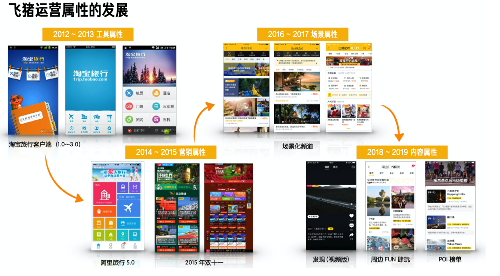

### 运营属性

> 以飞猪为例, 摘自[https://www.yuque.com/zaotalk/posts/sdwrpt](https://www.yuque.com/zaotalk/posts/sdwrpt)

- 工具属性, 2012 年阿里 allin 无线时, 飞猪 App 也随之产生, 这时主要还是工具属性, 提供快速查询机票门票信息.
- 营销属性, 14 年左右, 工具属性逐渐丰富起来, 同事经过双十一的火爆, 慢慢转化为一个营销卖货的属性, 当时各种营销平台都已经慢慢建立起来了
- 场景属性, 17 年左右, 当时主打场景运营心智, 包括出境超市、周末好去处等主题心智, 导购类平台在这时逐步萌芽
- 内容属性, 18 年后, 随着抖音/直播的火爆, 飞猪的运营类型也更加丰富起来, 由主题进化到了内容心智

### 前端发展史

五六年前，学个 React 或 Vue，再引入到项目中。用 ES6 开发，配合 gulp 或 grunt，搞个前后端分离的工程，那就很牛逼了，简直就是带着团队从石器时代迈入了工业时代。

然后过个一两年，再学个 webpack，搭个更好的研发脚手架，再配合打包分析，做做性能优化。在团队内做个分享并推广下，又是很不错的技术产出了。

又过个一两年，再学学 Node，有了服务端能力，配合 gitlab、jenkins 这些，前端可以自己搞个好用的发布系统、迭代系统，再引入前端监控服务等等，一套完成的前端基建就做的很完善了。又能继续成长、升职、加薪了。

问题来了，现在要做什么，现在能学什么？

去年阿里前端委员会主席圆心，《在未来前端的机会在哪里中》指出四大方向：

搭建服务
Serverless
智能化
IDE
