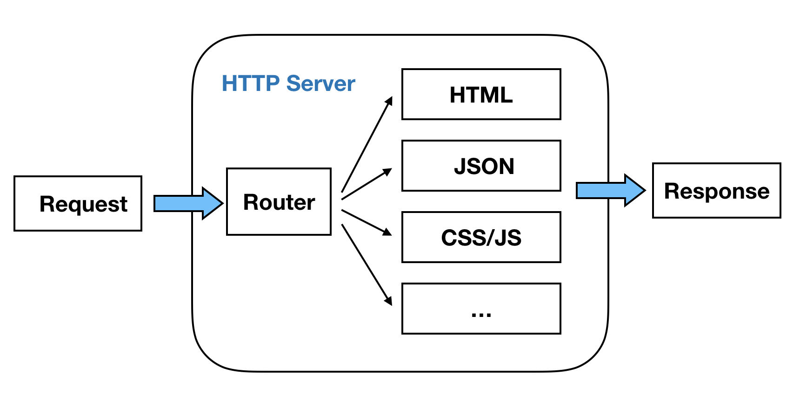

# 零零碎碎 - 一些常识名词

### 解构一个框架的源码，如果直接从所有源码开始分析，那就像是在一团毛线中找出头尾，很难分析。在这里，要分析 Egg.js 框架的原理，就将其精简到最小功能系统，再从此一个个功能分析和叠加上去。换句话说就是先化整为零，再从零到整。

### 最小 Web 系统可以精简成一下两个元素:

- HTTP Server HTTP 服务器，处理最基本请求(Request)和响应(Response)
- Route Parser 路由解析器，处理不同请求 URL 的跳转页面或者返回数据
  

### 顶级域名、一级域名、二级域名怎么定义的

首先顶级域名就是一级域名, 然后, 域名的级数, 从右往左以逗号为分割点, 第一个是一级域名, 第二个是二级域名, 第三个是三级域名, 依此类推. 以 naotu.baidu.com 为例:

- com 是顶级域名(一级域名)
- baidu 是二级域名
- naotu 是三级域名
  > 一般我们买的就是二级域名, 所以也可以称为主域名. 三级域名是用来做扩展的.

### 电商名词：类目、spu、sku

- 类目：类目是一个树状结构的系统，大体上可以分成 4-5 级。如手机->智能手机->苹果手机类目，在这里面，手机是一级类目，苹果手机是三级类目，也是叶子类目。
- SPU：苹果 6（商品聚合信息的最小单位），如手机->苹果手机->苹果 6，苹果 6 就是 SPU。
  - Standard Product Unit （标准产品单位）
  - 相当于淘宝中的某个商品
- SKU：土豪金 16G 苹果 6 （商品的不可再分的最小单元）。
  - stock keeping unit
  - 相当于淘宝中的某个商品中的具体型号。只有一个型号时，spu 相当于 sku，但是 id 值还是不一样的

从广义上讲，类目>SPU>SKU。

### UTC、GMT等时间
- GMT：Greenwich Mean Time，英国格林尼治天文台观测得到的时间，是他们当地的时间，以前作为标准时间使用
- UTC：Coordinated Universal Time，协调世界时，UT是世界时，根据原子钟计算出而时间，协调是指地球自转越来越慢，每年都会比前几年多出零点几秒，所以每隔几年协调世界时组织都会给世界时加上1秒

协调世界时作为标准时间，是可以根据地区所在时区，计算出该地区当前时间的，比如GMT = UTC + 0，北京是东八区：UTC + 8